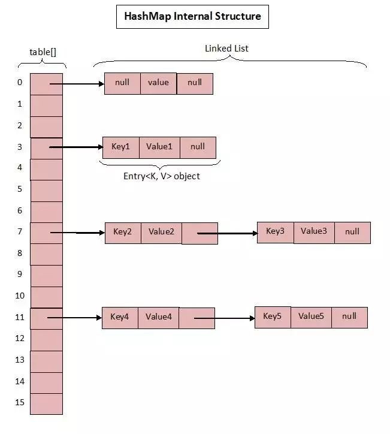
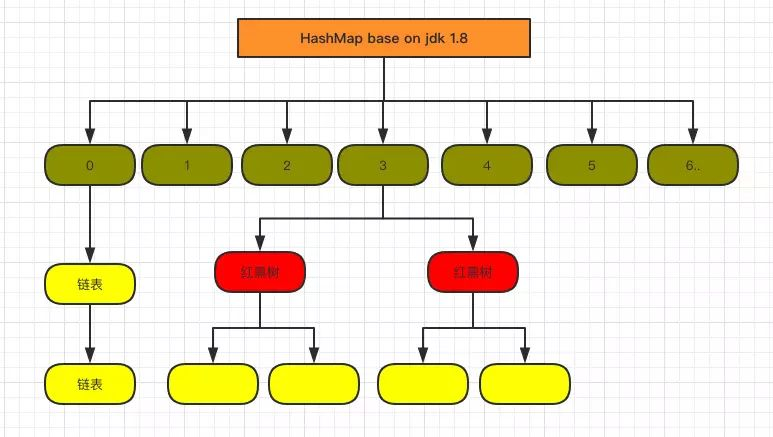
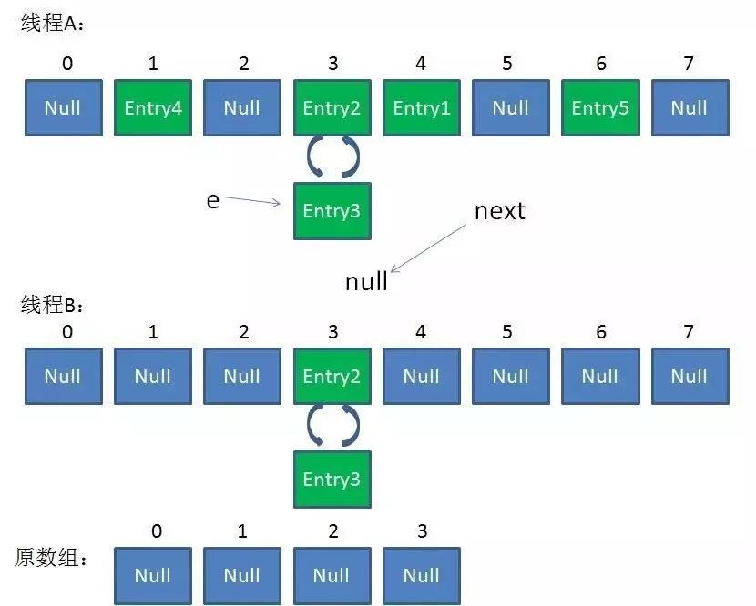
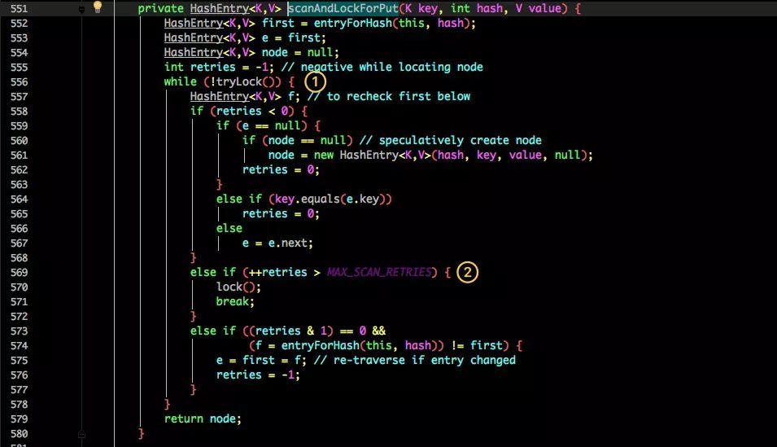
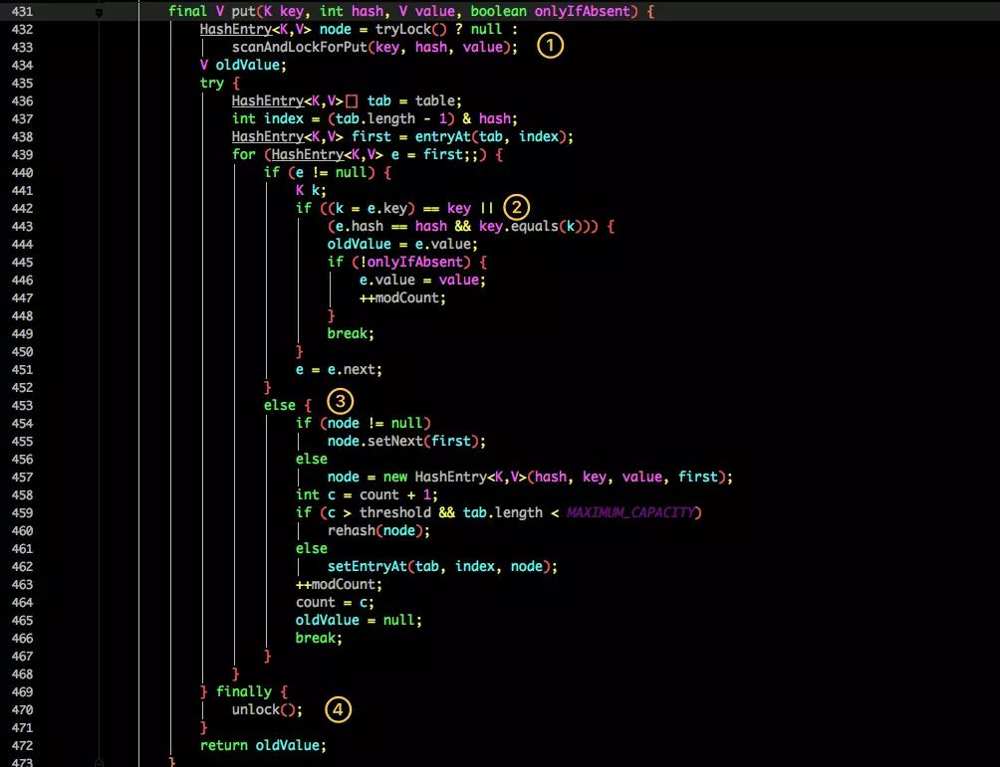

# HashMap笔记
## 前言
Map 这样的 **Key Value** 在软件开发中是非常经典的结构，常用于在内存中存放数据  

## HashMap的数据结构
哈希表结构(**链表散列:数组+链表形式**)实现,结合数组和链表的优点.当链表的长度超过8时,链表转换为红黑树
```
transient Node<K,V>\[\] table
```
### 基于Base JDK1.7
**数据结构图**  
  
**1.7 中的实现**
```java
public class HashMap<K,V> extends AbstractMap<K,V>
    implements Map<K,V>, Cloneable, Serializable {
     /**
      * 初始化桶的大小,由于底层是数组,所以默认为数组大小
      */
     static final int DEFAULT_INITIAL_CAPACITY = 1 << 4; // 若不人为初始化值,默认为16
 
     /**
      * 桶的最大值,2^30
      */
     static final int MAXIMUM_CAPACITY = 1 << 30;
 
     /**
      * 默认负载因子
      */
     static final float DEFAULT_LOAD_FACTOR = 0.75f;
 
    static final Entry<?,?>[] EMPTY_TABLE={};
    
    /**
    * table 真正存放数据的数组
    */
    transient Entry<K,V>[] table=(Entry<K,V>[])EMPTY_TABLE;

    /**
     * map 存放数量的大小,map.size()
     */
    transient int size;
    /**
     * 桶大小,初始化时可人为指定,若不指定,则为DEFAULT_INITIAL_CAPACITY=16
     *
     * @serial
     */
    int threshold;

    /**
     * 负载因子，可在初始化时显式指定,若不指定,则为DEFAULT_LOAD_FACTOR = 0.75f
     *
     * @serial
     */
    final float loadFactor;

}
```
#### 负载因子
```
   public HashMap() {
        this(DEFAULT_INITIAL_CAPACITY, DEFAULT_LOAD_FACTOR);
    }

    public HashMap(int initialCapacity, float loadFactor) {
        if (initialCapacity < 0)
            throw new IllegalArgumentException("Illegal initial capacity: " +
                                               initialCapacity);
        if (initialCapacity > MAXIMUM_CAPACITY)
            initialCapacity = MAXIMUM_CAPACITY;
        if (loadFactor <= 0 || Float.isNaN(loadFactor))
            throw new IllegalArgumentException("Illegal load factor: " +
                                               loadFactor);

        this.loadFactor = loadFactor;
        threshold = initialCapacity;
        init();
    }
```
给定的**默认容量为 16**，**负载因子为 0.75**。Map 在使用过程中不断的往里面存放数据，当数量达到了 **16 * 0.75 = 12** 就需要将当前 16 的容量进行扩容，而扩容这个过程涉及到 rehash、复制数据等操作，所以非常消耗性能   
因此通常建议能提前预估 HashMap 的大小最好，尽量的减少扩容带来的性能损耗  
根据代码可以看到其实真正存放数据的是**transient Entry<K,V>[] table = (Entry<K,V>[]) EMPTY_TABLE** 
```java
public class HashMap<K,V> extends AbstractMap<K,V>
    implements Map<K,V>, Cloneable, Serializable {
/**
     * Basic hash bin node, used for most entries.  (See below for
     * TreeNode subclass, and in LinkedHashMap for its Entry subclass.)
     */
    static class Entry<K,V> implements Map.Entry<K,V> {
        int hash;
        final K key;
        V value;
        Entry<K,V> next;

        Entry(int hash, K key, V value, Entry<K,V> next) {
            this.hash = hash;
            this.key = key;
            this.value = value;
            this.next = next;
        }

        public final K getKey()        { return key; }
        public final V getValue()      { return value; }

        public final V setValue(V newValue) {
            V oldValue = value;
            value = newValue;
            return oldValue;
        }
   }
}
```
**Entry** 是 HashMap 中的一个内部类，从他的成员变量很容易看出:  
>key 就是写入时的键。  
>value 自然就是值。  
>开始的时候就提到 HashMap 是由数组和链表组成，所以这个 next 就是用于实现链表结构。  
>hash 存放的是当前 key 的 hashcode
#### PUT方法
```
   public V put(K key, V value) {
       // 判断数组是否已经初始化
       if (table == EMPTY_TABLE) {
           inflateTable(threshold);
       }
       // 判断key是否为空,为空返回一个空值
       if (key == null)
           return putForNullKey(value);
       // 获取当前key的hash值
       int hash = hash(key);
       // 根据hash值以及桶的大小获取插入桶的位置
       int i = indexFor(hash, table.length);
       // 如果桶是一个链表则需要遍历判断里面的 hashcode、key 是否和传入 key 相等，如果相等则进行覆盖，并返回原来的值
       for (Entry<K,V> e = table[i]; e != null; e = e.next) {
           Object k;
           if (e.hash == hash && ((k = e.key) == key || key.equals(k))) {
               V oldValue = e.value;
               e.value = value;
               e.recordAccess(this);
               return oldValue;
           }
       }
       modCount++;
       // 如果桶是空的，说明当前位置没有数据存入；新增一个 Entry 对象写入当前位置
       addEntry(hash, key, value, i);
       return null;
   }

```

```
    void addEntry(int hash, K key, V value, int bucketIndex) {
        if ((size >= threshold) && (null != table[bucketIndex])) {
            resize(2 * table.length);
            hash = (null != key) ? hash(key) : 0;
            bucketIndex = indexFor(hash, table.length);
        }

        createEntry(hash, key, value, bucketIndex);
    }

    void createEntry(int hash, K key, V value, int bucketIndex) {
        Entry<K,V> e = table[bucketIndex];
        table[bucketIndex] = new Entry<>(hash, key, value, e);
        size++;
    }
```
当调用 addEntry 写入 Entry 时需要判断是否需要扩容。  
如果需要就进行两倍扩充，并将当前的 key 重新 hash 并定位。  
而在 createEntry 中会将当前位置的桶传入到新建的桶中，如果当前桶有值就会在位置形成链表  
#### GET方法
 ```
    public V get(Object key) {
        if (key == null)
            return getForNullKey();
        Entry<K,V> entry = getEntry(key);

        return null == entry ? null : entry.getValue();
    }

    final Entry<K,V> getEntry(Object key) {
        if (size == 0) {
            return null;
        }
        // 根据key值获取hash值,确定桶的位置
        int hash = (key == null) ? 0 : hash(key);
        // 循环链表
        for (Entry<K,V> e = table[indexFor(hash, table.length)];e != null;e = e.next) {
            Object k;
            if (e.hash == hash && ((k = e.key) == key || (key != null && key.equals(k))))
                return e;
        }
        return null;
    }
```
### 基于Base JDK1.8
基于JDK1.7,其中很明显的一个缺点在于:**当 Hash 冲突严重时，在桶上形成的链表会变的越来越长，这样在查询时的效率就会越来越低；时间复杂度为 O(N)**  
  
```java
public class HashMap<K,V> extends AbstractMap<K,V>
    implements Map<K,V>, Cloneable, Serializable {
      /**
       * 初始化桶的大小,由于底层是数组,所以默认为数组大小
       */
      static final int DEFAULT_INITIAL_CAPACITY = 1 << 4; // 若不人为初始化值,默认为16
  
      /**
       * 桶的最大值,2^30
       */
      static final int MAXIMUM_CAPACITY = 1 << 30;
  
      /**
       * 默认负载因子
       */
      static final float DEFAULT_LOAD_FACTOR = 0.75f;

    /**
     * 阈值,判断是否将链表转换为红黑树
     */
    static final int TREEIFY_THRESHOLD = 8;
     /**
      * Node 的核心组成其实也是和 1.7 中的 HashEntry 一样，存放的都是 key value hashcode next 等数据
      */
    transient Node<K,V>[] table;

    transient Set<Map.Entry<K,V>> entrySet;
}
```
#### PUT方法
```java
public class HashMap<K,V> extends AbstractMap<K,V>
    implements Map<K,V>, Cloneable, Serializable {
 /**
     * 继承Map中的put方法,并重写此方法
     *
     * @param hash key的hash值
     * @param key key值
     * @param value value值
     * @param onlyIfAbsent 是否修改原有数据
     * @param evict 如果为false，则表处于创建模式
     * @return 无
     */
    final V putVal(int hash, K key, V value, boolean onlyIfAbsent,boolean evict) {
        Node<K,V>[] tab; 
        Node<K,V> p; 
        int n, i;
        // 判断当前数组是否为空,为空的话则进行初始化(resize 会判断是狗进行初始化) 
        if ((tab = table) == null || (n = tab.length) == 0)
            n = (tab = resize()).length;
        // 根据当前key的hashcode定位到具体的桶中并判断是否为空,如果为空则无碰撞发生,则直接新增一个Node即可
        if ((p = tab[i = (n - 1) & hash]) == null)
            tab[i] = newNode(hash, key, value, null);
        else {
            Node<K,V> e; 
            K k;
            // 如果当前桶有值（ Hash 冲突），那么就要比较当前桶中的 key、key 的 hashcode 与写入的 key 是否相等，相等就赋值给 e,在之后的时候会统一进行赋值及返回
            if (p.hash == hash &&
                ((k = p.key) == key || (key != null && key.equals(k))))
                e = p;
            // 判断当前是否为红黑树,是的话则按照红黑树的方法进行操作
            else if (p instanceof TreeNode)
                e = ((TreeNode<K,V>)p).putTreeVal(this, tab, hash, key, value);
            else {
                // 如果是个链表，就需要将当前的 key、value 封装成一个新节点写入到当前桶的后面（形成链表）
                for (int binCount = 0; ; ++binCount) {
                    if ((e = p.next) == null) {
                        p.next = newNode(hash, key, value, null);
                        // 接着判断当前链表的大小是否大于预设的阈值，大于时就要转换为红黑树
                        if (binCount >= TREEIFY_THRESHOLD - 1) // -1 for 1st
                            treeifyBin(tab, hash);
                        break;
                    }
                    // 如果在遍历过程中找到 key 相同时直接退出遍历
                    if (e.hash == hash &&
                        ((k = e.key) == key || (key != null && key.equals(k))))
                        break;
                    p = e;
                }
            }
            if (e != null) { // 如果 e != null 就相当于存在相同的 key,那就需要将值覆盖
                V oldValue = e.value;
                if (!onlyIfAbsent || oldValue == null)
                    e.value = value;
                afterNodeAccess(e);
                        return oldValue;
            }
        }
        ++modCount;
        // 最后判断是否需要进行扩容
        if (++size > threshold)
            resize();
        afterNodeInsertion(evict);
        return null;
    }
}
```
#### GET方法
```java
public class HashMap<K,V> extends AbstractMap<K,V>
    implements Map<K,V>, Cloneable, Serializable {
    public V get(Object key) {
        Node<K,V> e;
        return (e = getNode(hash(key), key)) == null ? null : e.value;
    }
    
    final Node<K,V> getNode(int hash, Object key) {
        Node<K,V>[] tab; Node<K,V> first, e; int n; K k;
        // 首先将 key hash 之后取得所定位的桶 如果桶为空则直接返回 null 
        if ((tab = table) != null && (n = tab.length) > 0 &&
            (first = tab[(n - 1) & hash]) != null) {
            // 否则判断桶的第一个位置(有可能是链表、红黑树)的 key 是否为查询的 key，是就直接返回 value
            if (first.hash == hash && 
                ((k = first.key) == key || (key != null && key.equals(k))))
                return first;
            if ((e = first.next) != null) {
                // 如果第一个不匹配，则判断它的下一个是红黑树还是链表
                if (first instanceof TreeNode)
                    return ((TreeNode<K,V>)first).getTreeNode(hash, key);
                // 按照链表的方式遍历匹配返回值
                do {
                    if (e.hash == hash &&
                        ((k = e.key) == key || (key != null && key.equals(k))))
                        return e;
                } while ((e = e.next) != null);
            }
        }
        return null;
    }
}
```
### HashMap 非线程安全
HashMap 扩容的时候会调用 **resize()** 方法,就是这里的并发操作容易在一个桶上形成环形链表  
这样当获取一个不存在的 key 时，计算出的 **index** 正好是环形链表的下标就会出现死循环  
  
  
### HashMap 遍历方式
**第一种**  
```
Iterator<Map.Entry<String, Integer>> entryIterator = map.entrySet().iterator();
         while (entryIterator.hasNext()) {
             Map.Entry<String, Integer> next = entryIterator.next();
             System.out.println("key=" + next.getKey() + " value=" + next.getValue());
         }
```
**第二种**  
```
Iterator<String> iterator = map.keySet().iterator();
        while (iterator.hasNext()){
            String key = iterator.next();
            System.out.println("key=" + key + " value=" + map.get(key));

        }
```
**建议使用第一种循环遍历的方式**  
第一种可以把key value同时取出来,然而第二种需要通过key再去取一次,效率低  
>无论是 1.7 还是 1.8 其实都能看出 JDK 没有对它做任何的同步操作，所以并发会出问题，甚至出现死循环导致系统不可用

**JDK 推出了专项专用的 ConcurrentHashMap**
## ConcurrentHashMap数据结构
### 基于Base JDK1.7
  
ConcurrentHashMap是由 Segment 数组、HashEntry 组成，和 HashMap 一样，仍然是**数组加链表**  
**核心成员变量**  
```
    /**
     * Segment 数组，存放数据时首先需要定位到具体的 Segment 中。
     */
    final Segment<K,V>[] segments;

    transient Set<K> keySet;
    transient Set<Map.Entry<K,V>> entrySet;
```
**Segment 是 ConcurrentHashMap 的一个内部类**  
```
    static final class Segment<K,V> extends ReentrantLock implements Serializable {

        private static final long serialVersionUID = 2249069246763182397L;

        // 和 HashMap 中的 HashEntry 作用一样，真正存放数据的桶
        transient volatile HashEntry<K,V>[] table;

        transient int count;

        transient int modCount;

        transient int threshold;

        final float loadFactor;

    }

```
**HashEntry的组成**  
```java
static final class HashEntry<K,V>  {
        final int hash;
        final K key;
        volatile V val;
        volatile Node<K,V> next;

        HashEntry(int hash, K key, V val, HashEntry<K,V> next) {
            this.hash = hash;
            this.key = key;
            this.val = val;
            this.next = next;
        }
}
```
和 HashMap 非常类似，唯一的区别就是其中的核心数据如 value ，以及链表都是 volatile 修饰的，保证了获取时的可见性。
ConcurrentHashMap 采用了分段锁技术，其中 Segment 继承于 ReentrantLock。不会像 HashTable 那样不管是 put 还是 get 操作都需要做同步处理，理论上 ConcurrentHashMap 支持 CurrencyLevel (Segment 数组数量)的线程并发。每当一个线程占用锁访问一个 Segment 时，不会影响到其他的 Segment  
#### PUT方法
``` 
   // 通过 key 定位到 Segment，之后在对应的 Segment 中进行具体的 put
    public V put(K key, V value) {
        Segment<K,V> s;
        if (value == null)
            throw new NullPointerException();
        int hash = hash(key);
        int j = (hash >>> segmentShift) & segmentMask;
        if ((s = (Segment<K,V>)UNSAFE.getObject          
             (segments, (j << SSHIFT) + SBASE)) == null) 
            s = ensureSegment(j);
        return s.put(key, hash, value, false);
    }
```
```
         // 虽然 HashEntry 中的 value 是用 volatile 关键词修饰的，但是并不能保证并发的原子性，所以 put 操作时仍然需要加锁处理
        final V put(K key, int hash, V value, boolean onlyIfAbsent) {
            HashEntry<K,V> node = tryLock() ? null :
                scanAndLockForPut(key, hash, value);
            V oldValue;
            try {
                HashEntry<K,V>[] tab = table;
                int index = (tab.length - 1) & hash;
                HashEntry<K,V> first = entryAt(tab, index);
                for (HashEntry<K,V> e = first;;) {
                    if (e != null) {
                        K k;
                        if ((k = e.key) == key ||
                            (e.hash == hash && key.equals(k))) {
                            oldValue = e.value;
                            if (!onlyIfAbsent) {
                                e.value = value;
                                ++modCount;
                            }
                            break;
                        }
                        e = e.next;
                    }
                    else {
                        if (node != null)
                            node.setNext(first);
                        else
                            node = new HashEntry<K,V>(hash, key, value, first);
                        int c = count + 1;
                        if (c > threshold && tab.length < MAXIMUM_CAPACITY)
                            rehash(node);
                        else
                            setEntryAt(tab, index, node);
                        ++modCount;
                        count = c;
                        oldValue = null;
                        break;
                    }
                }
            } finally {
                unlock();
            }
            return oldValue;
        }

```
第一步的时候会尝试获取锁，如果获取失败肯定就有其他线程存在竞争，则利用 scanAndLockForPut() 自旋获取锁  
  
  1.尝试自旋获取锁  
  
  2.如果重试的次数达到了 MAX_SCAN_RETRIES 则改为阻塞锁获取，保证能获取成功  
  
1.将当前 Segment 中的 table 通过 key 的 hashcode 定位到 HashEntry  

2.遍历该 HashEntry，如果不为空则判断传入的 key 和当前遍历的 key 是否相等，相等则覆盖旧的 value  

3.不为空则需要新建一个 HashEntry 并加入到 Segment 中，同时会先判断是否需要扩容  

4.最后会解除在 1 中所获取当前 Segment 的锁  

#### GET方法
```
    public V get(Object key) {
        Segment<K,V> s; 
        HashEntry<K,V>[] tab;
        int h = hash(key);
        long u = (((h >>> segmentShift) & segmentMask) << SSHIFT) + SBASE;
        if ((s = (Segment<K,V>)UNSAFE.getObjectVolatile(segments, u)) != null &&
            (tab = s.table) != null) {
            for (HashEntry<K,V> e = (HashEntry<K,V>) UNSAFE.getObjectVolatile
                     (tab, ((long)(((tab.length - 1) & h)) << TSHIFT) + TBASE);
                 e != null; e = e.next) {
                K k;
                if ((k = e.key) == key || (e.hash == h && key.equals(k)))
                    return e.value;
            }
        }
        return null;
    }

```
只需要将 Key 通过 Hash 之后定位到具体的 Segment ，再通过一次 Hash 定位到具体的元素上  
由于 HashEntry 中的 value 属性是用 volatile 关键词修饰的，保证了内存可见性，所以每次获取时都是最新值  
ConcurrentHashMap 的 get 方法是非常高效的，因为整个过程都不需要加锁  
