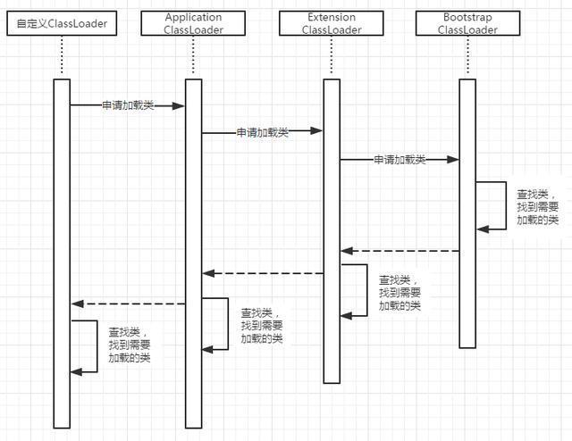
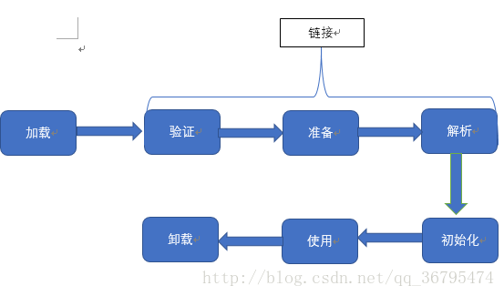
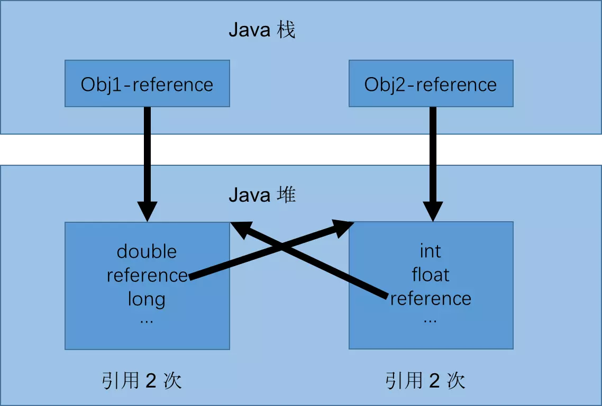
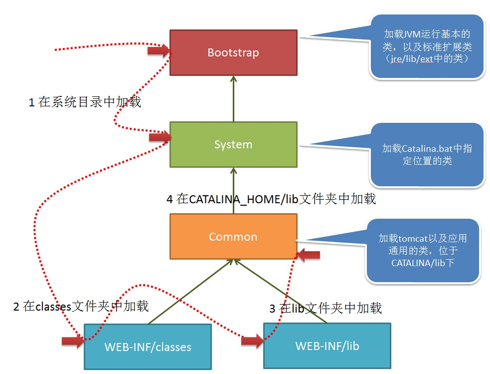
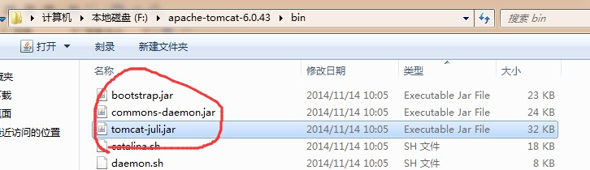
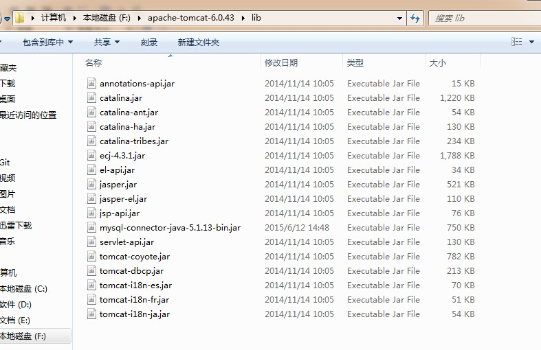

# JVM笔记
## JVM加载Class文件的原理机制

----
Java中所有的类都需要由类加载器加载到JVM中才能运行.类加载器本身也是也是一个类,而它的工作就是把class文件从硬盘读取到内存中,在写程序的时候,我们几乎不需要关心类的加载,因为这些都是隐式加载的.除非我们有特殊的需求,比如映射,就需要显示加载所需要的类.  
Java类的加载是动态的,它并不会一次性加载完所有的类,而是保证加载完成程序运行的基本类.至于其他类,则是在需要的时候才进行加载.  
Java类加载器有三个,就对应Java的三种类:  
> BootstrapLoader => 负责加载系统类(指的是内置类,像是String类)--负责加载$JAVA_HOME中jre/lib/rt.jar里所有的class，由C++实现，不是ClassLoader子类
>> ExtClassLoader => 负责加载扩展类(就是继承类和实现类)
>>> AppClassLoader => 负责加载应用类(程序自定的类)  
>>>> 自定义类加载器 =>  若要实现自定义类加载器，只需要继承java.lang.ClassLoader类，并且重写findClass()方法即可  
                       java.lang.ClassLoader类的基本职责就是根据一个指定的类的名称，找到或者生成对应的字节码，然后从这些字节码中定义出一个Java类，即java.lang.Class类的一个实例。除此之外，ClassLoader还负责加载Java应用所需的资源，如图像文件和配置文件等，ClassLoader中与加载类相关的方法如下：                    
                       
                       getParent()    返回该类加载器的父类加载器
                       
                       loadClass(String name)    加载名称为二进制名称为name的类，返回的结果是java.lang.Class类的实例。
                       
                       findClass(String name)      查找名称为name的类，返回的结果是java.lang.Class类的实例。
                       
                       findLoaderClass(String name)    查找名称为name的已经被加载过的类，返回的结果是java.lang.Class类的实例。
                       
                       resolveClass(Class<?> c)    链接指定的Java类。
           

Java采用**委托模型机制**:  
双亲委派机制，其工作原理的是，如果一个类加载器收到了类加载请求，它并不会自己先去加载，而是把这个请求委托给父类的加载器去执行，如果父类加载器还存在其父类加载器，则进一步向上委托，依次递归，请求最终将到达顶层的启动类加载器，如果父类加载器可以完成类加载任务，就成功返回，倘若父类加载器无法完成此加载任务，子加载器才会尝试自己去加载，这就是双亲委派模式，即每个儿子都很懒，每次有活就丢给父亲去干，直到父亲说这件事我也干不了时，儿子自己才想办法去完成.
 
```
public Class<?> loadClass(String name) throws ClassNotFoundException {
        return loadClass(name, false);
    }
 
    protected synchronized Class<?> loadClass(String name, boolean resolve)
            throws ClassNotFoundException {
 
        // 首先判断该类型是否已经被加载
        Class c = findLoadedClass(name);
        if (c == null) {
            //如果没有被加载，就委托给父类加载或者委派给启动类加载器加载
            try {
                if (parent != null) {
                    //如果存在父类加载器，就委派给父类加载器加载
                    c = parent.loadClass(name, false);
                } else {
                    //如果不存在父类加载器，就检查是否是由启动类加载器加载的类，
                    //通过调用本地方法native findBootstrapClass0(String name)
                    c = findBootstrapClass0(name);
                }
            } catch (ClassNotFoundException e) {
                // 如果父类加载器和启动类加载器都不能完成加载任务，才调用自身的加载功能
                c = findClass(name);
            }
        }
        if (resolve) {
            resolveClass(c);
        }
        return c;
    }
``` 
 双亲委派机制的优势：采用双亲委派模式的是好处是Java类随着它的类加载器一起具备了一种带有优先级的层次关系，通过这种层级关可以避免类的重复加载，当父亲已经加载了该类时，就没有必要子ClassLoader再加载一次。其次是考虑到安全因素，java核心api中定义类型不会被随意替换，假设通过网络传递一个名为java.lang.Integer的类，通过双亲委托模式传递到启动类加载器，而启动类加载器在核心Java API发现这个名字的类，发现该类已被加载，并不会重新加载网络传递的过来的java.lang.Integer，而直接返回已加载过的Integer.class，这样便可以防止核心API库被随意篡改.
**注意:Java在逻辑上并不存在BootstrapLoader的实体(由C++实现，不是ClassLoader子类)**  
Java采用**缓存机制**:  
缓存机制将会保证所有加载过的Class都会被缓存，当程序中需要使用某个Class时，类加载器先从缓存区中搜寻该Class，只有当缓存区中不存在该Class对象时，系统才会读取该类对应的二进制数据，并将其转换成Class对象，存入缓冲区中。这就是修改了Class后，必须重新启动JVM，程序所做的修改才会生效的原因.  
**双亲委派机制是否可以被绕过**  
答案显然是可以的。我们可以通过自定义一个类加载器，并且实现它的loadClass方法，在这个方法中不优先去父类加载器中查找类就可以了。需要注意的是，在ClassLoader中有一个方法：preDefineClass，该方法会用来校验待加载类的信息，比如：java开头的类会直接抛出异常  

### 原理机制
  
  类加载的生命周期包括以下几个部分：加载（Loading）、验证（Verification）、准备（Preparation）、解析（Resolution）、初始化（Initialization）、使用（Using）、卸载（Unloading）,其中验证、准备、解析三个部分统称链接.  
  加载（装载）、验证、准备、初始化和卸载这五个阶段顺序是固定的，类加载过程必须按照这种顺序开始，而解析阶段不一定，它在某些情况下可以在初始化之后再开始，这是为了运行时动态绑定特性（JIT例如接口只在调用的时候才知道具体的实现的是哪个子类）。值得注意的是：这些阶段通常都是交叉的混合式进行的，通常会在一个阶段执行的过程中调用或激活另一个阶段.  
 #### 加载
   加载这个阶段通常也被称为"装载"，它的主要任务主要有一下几点：  

     1、通过"类全名"来获取定义此类的二进制字节流  
     
     2、将字节流所代表的静态存储结构转换为方法区的运行时数据结构  
     
     3、在java堆中生成一个代表这个类的java.lang.Class对象，作为方法区这些数据的访问入口  
 
   相对于类加载过程的其他阶段，加载阶段是通过类加载（ClassLoader）来完成的，而类加载器也可以由用户自定义完成，因此，开发人员可以通过定义类加载器去控制字节流的获取方式。加载之后，二进制文件会被读入到虚拟机所需的格式存储在方法区中，方法区中存储格式由虚拟机自行定义，然后在java堆中实例化一个java.lang.Class类对象，通过这个对象就可以访问方法区中的数据  
 #### 验证
   验证阶段是链接阶段的第一步，目的就是确保class文件的字节流中包含的信息符合虚拟机的要求，不能危害虚拟机自身安全。验证阶段主要包括四个检验过程：文件格式验证、元数据验证、字节码验证和符号引用验证  
    
    1、文件格式验证
       验证class文件格式规
    2、元数据验证
       就是对字节码描述的信息进行语义分析，保证描述的信息符合java语言规范。验证点可能包括这个类是否有父类（除Object）、这个类是否继承了不允许被继承的类（final修饰的）、如果这个类的父类是抽象类，是否实现了父类或接口中要求实现的方法
    3、字节码验证
       进行数据流和控制流分析，这个阶段对类的方法体进行校验，保证被校验的方法在运行时不会做出危害虚拟机的行为
    4、符号引用验证
       符号引用中通过字符串描述的权限定名是否能找到对应的类、符号引用类中的类，字段和方法的访问性（private protected public default）是否能被当前类访问  
 #### 准备
   这个阶段就是为**类变量分配内存并设置类变量初始值**的阶段，这些内存将在方法区中进行分配  
   要注意的是，进行分配内存的只是包括类变量，而不包括实例变量，实例变量是在对象实例化时随着对象一起分配在java堆中的  
   通常情况下，初始值为零值.假设``public static int value=2``,那么value在准备阶段过后的**初始值为0，不为2**，这时候只是开辟了内存空间，并没有运行java代码，value赋值为2的指令是程序被编译后，存放于类构造器clinit()方法之中，所以value被赋值为2是在初始化阶段才会执行  
   对于一些特殊情况，如果类字段属性表中存在ConstantValue属性，那在准备阶段变量value就会被初始化为ConstantValue属性所指的值，那么对于上面value,编译时javac将会为value生成ConstantValue属性，在准备阶段虚拟机就会根据ConstantValue将value设置为2  
 #### 解析
   解析阶段是虚拟机常量池的符号引用替换为直接引用的过程
   符号引用：符号引用是一组符号来描述所引用的对象，符号可以是任何形式的字面量，只要使用时能定位到目标即可，符号引用与虚拟机实现的内存布局无关，引用的目标对象并不一定已经加载到内存中
   直接引用：直接引用可以是直接指向目标对象的指针、相对偏移量或是一个能间接定位到目标的句柄（一种特殊的智能指针）。直接引用是与虚拟机内存布局实现相关，同一个符号引用在不同虚拟机实例上翻译出来的直接引用一般不会相同，如果有了直接引用，那引用的目标必定存在内存中
   解析过程主要针对类或接口、字段、类方法、接口方法四类符号引用进行。
  
  #### 初始化
   类的初始化阶段是加载过程的最后一步，在准备阶段，类变量已赋过一次系统要求的初始值，而在初始化阶段，则是根据程序员通过程序制定的主观计划去初始化类变量和其他资源，或者可以从另外一个角度表达：**初始化阶段是执行类构造器<clinit>()方法的过程**  
   在以下四种情况下初始化过程会被触发执行：  

      1、遇到new、getstatic、putstatic或invokestatic这4条字节码指令时，如果类没有进行过初始化，则需先触发其初始化。生成这4条指令的最常见的java代码场景是：使用new关键字实例化对象、读取或设置一个类的静态字段(被final修饰、已在编译器把结果放入常量池的静态字段除外)的时候，以及调用类的静态方法的时候。
      
      2、使用java.lang.reflect包的方法对类进行反射调用的时候
      
      3、当初始化一个类的时候，如果发现其父类还没有进行过初始化、则需要先触发其父类的初始化
      
      4、jvm启动时，用户指定一个执行的主类(包含main方法的那个类)，虚拟机会先初始化这个类
      
   类构造器<clinit>()方法是由编译器自动收集类中的所有类变量的赋值动作和静态语句块(static块)中的语句合并产生的，编译器收集的顺序是由语句在源文件中出现的顺序所决定的，静态语句块中只能访问到定义在静态语句块之前的变量，定义在它之后的变量，在前面的静态语句可以赋值，但是不能访问  
   
## JVM 内存分配
### 基本概念
  每运行一个Java程序会产生一个Java进程,每个Java程序都会产生一个或多个线程.每一个进程对应唯一一个JVM实例,每一个JVM实例对应用一个堆.每一个线程有一个自己私有的栈  
  进程所创建的所有类的实例(也就是对象)或数组(指的是数组本身)都放在堆中,并由该进程所有的进程共享,并由该进程所有的线程共享.
  Java中分配堆内存是自动初始化的,即为一个对象分配内存的时候,会初始化这个对象中的变量.虽然Java中所有对象的存储空间都是在堆中分配的,但是这个对象的引用却是在栈中分配的.也就是说,在建立一个对象是在堆和栈中都分配了内存.在堆中分配的内存其实是存在这个创建的对象本身,而在栈中分配的内存只是存放这个对象的引用而已  
  当局部变量被new出来之后,在栈空间以及堆空间都分配了内存,当局部变量生命周期结束之后,栈空间立即会回收,堆空间区域等待GC回收.
### 具体概念
  众所周知，Java虚拟机在执行Java程序时会把所管理的内存分为若干个不同的数据区域（也称为运行时数据区），大致也划分为方法区（Method Area）、虚拟机栈（VM Stack）、本地方法栈（Native ）、堆（Heap）、程序计数器（Progra Counter Register）等五部分，不过随着JDK升级，内存模型也在发生变化  
  
#### 程序计数器
> 内存空间小，线程私有。字节码解释器工作是就是通过改变这个计数器的值来选取下一条需要执行指令的字节码指令，分支、循环、跳转、异常处理、线程恢复等基础功能都需要依赖计数器完成

如果线程正在执行一个 Java 方法，这个计数器记录的是正在执行的虚拟机字节码指令的地址；如果正在执行的是 Native 方法，这个计数器的值则为 (Undefined)。此内存区域是唯一一个在 Java 虚拟机规范中没有规定任何 OutOfMemoryError 情况的区域。  
>>>  简单地讲，一个Native Method就是一个java调用非java代码的接口。一个Native Method是这样一个java的方法：该方法的实现由非java语言实现，比如C。这个特征并非java所特有，很多其它的编程语言都有这一机制，比如在C＋＋中，你可以用extern "C"告知C＋＋编译器去调用一个C的函数
       native是与C++联合开发的时候用的！使用native关键字说明这个方法是原生函数，也就是这个方法是用C/C++语言实现的，并且被编译成了DLL，由java去调用。 这些函数的实现体在DLL中，JDK的源代码中并不包含，你应该是看不到的。对于不同的平台它们也是不同的。这也是java的底层机制，实际上java就是在不同的平台上调用不同的native方法实现对操作系统的访问的。总而言之：
     
     1.native 是用做java 和其他语言（如c++）进行协作时使用的，也就是native 后的函数的实现不是用java写的
     
     2.既然都不是java，那就别管它的源代码了，我们只需要知道这个方法已经被实现即可
     
     3.native的意思就是通知操作系统， 这个函数你必须给我实现，因为我要使用。 所以native关键字的函数都是操作系统实现的， java只能调用
     
     4.java是跨平台的语言，既然是跨了平台，所付出的代价就是牺牲一些对底层的控制，而java要实现对底层的控制，就需要一些其他语言的帮助，这个就是native的作用了

#### Java虚拟机栈
 > 线程私有，生命周期和线程一致。描述的是 Java 方法执行的内存模型：每个方法在执行时都会床创建一个栈帧(Stack Frame)用于存储局部变量表、操作数栈、动态链接、方法出口等信息。每一个方法从调用直至执行结束，就对应着一个栈帧从虚拟机栈中入栈到出栈的过程

**局部变量表**：存放了编译期可知的各种基本类型(boolean、byte、char、short、int、float、long、double)、对象引用(reference 类型)和 returnAddress 类型(指向了一条字节码指令的地址)  
**StackOverflowError**：线程请求的栈深度大于虚拟机所允许的深度  
**OutOfMemoryError**：如果虚拟机栈可以动态扩展，而扩展时无法申请到足够的内存    

#### 本地方法栈
> 区别于 Java 虚拟机栈的是，Java 虚拟机栈为虚拟机执行 Java 方法(也就是字节码)服务，而本地方法栈则为虚拟机使用到的 Native 方法服务。也会有 StackOverflowError 和 OutOfMemoryError 异常  

#### Java堆
> 对于绝大多数应用来说，这块区域是 JVM 所管理的内存中最大的一块。线程共享，主要是存放对象实例和数组。内部会划分出多个线程私有的分配缓冲区(Thread Local Allocation Buffer, TLAB)。可以位于物理上不连续的空间，但是逻辑上要连续  

**OutOfMemoryError**：如果堆中没有内存完成实例分配，并且堆也无法再扩展时，抛出该异常

#### 方法区
> 属于共享内存区域，存储已被虚拟机加载的类信息、常量、静态变量、即时编译器编译后的代码等数据


#### 运行时常量池
>属于方法区一部分，用于存放编译期生成的各种字面量和符号引用。编译器和运行期(String 的 intern() )都可以将常量放入池中。内存有限，无法申请时抛出 OutOfMemoryError
>> String 的 intern()==>API上的那几句关于这个方法，其实总结一句就是调用这个方法之后把字符串对象加入常量池中，常量池我们都知道他是存在于方法区的，他是方法区的一部分，而方法区是线程共享的，所以常量池也就是线程共享的，但是他并不是线程不安全的，他其实是线程安全的，他仅仅是让有相同值的引用指向同一个位置而已，如果引用值变化了，但是常量池中没有新的值，那么就会新开辟一个常量结果来交给新的引用，而并非像线程不同步那样，针对同一个对象，new出来的字符串和直接赋值给变量的字符串存放的位置是不一样的，前者是在堆里面，而后者在常量池里面，另外，在做字符串拼接操作，也就是字符串相"+"的时候，得出的结果是存在在常量池或者堆里面，这个是根据情况不同不一定的  
 ```
　String str1 = "aaa";
  String str2 = "bbb";
  String str3 = "aaabbb";
  String str4 = str1 + str2;
  String str5 = "aaa" + "bbb";
  System.out.println(str3 == str4); // false
  System.out.println(str3 == str4.intern()); // true
  System.out.println(str3 == str5);// true
```
#### 直接内存
>非虚拟机运行时数据区的部分

在 JDK 1.4 中新加入 NIO (New Input/Output) 类，引入了一种基于通道(Channel)和缓存(Buffer)的 I/O 方式，它可以使用 Native 函数库直接分配堆外内存，然后通过一个存储在 Java 堆中的 DirectByteBuffer 对象作为这块内存的引用进行操作。可以避免在 Java 堆和 Native 堆中来回的数据耗时操作  
**OutOfMemoryError**：会受到本机内存限制，如果内存区域总和大于物理内存限制从而导致动态扩展时出现该异常

## 对象已死吗
程序计数器、虚拟机栈、本地方法栈 3 个区域随线程生灭(因为是线程私有)，栈中的栈帧随着方法的进入和退出而有条不紊地执行着出栈和入栈操作。而 Java 堆和方法区则不一样，一个接口中的多个实现类需要的内存可能不一样，一个方法中的多个分支需要的内存也可能不一样，我们只有在程序处于运行期才知道那些对象会创建，这部分内存的分配和回收都是动态的，垃圾回收期所关注的就是这部分内存
### 引用计数法
给对象添加一个引用计数器,每当有一个地方引用它时,计数器就会加1,当引用失效的时候,计数器减1,任何时候计数器的值为0的对象表示不可能在被使用.
**给对象添加一个引用计数器。但是难以解决循环引用问题**  

### 可达性分析法
通过一系列的称为"GC Roots"的对象作为起点,从这些节点开始往下搜索,搜索所走过的路径成为引用链(Reference Chain),当一个对象到GC Roots没有任何引用链相连时,则证明对象不可用  
 
**可作为 GC Roots 的对象：**
    
    1.虚拟机栈(栈帧中的本地变量表)中引用的对象
    2.方法区中类静态属性引用的对象
    3.方法区中常量引用的对象
    4.本地方法栈中 JNI(即一般说的 Native 方法) 引用的对象
    
 ### 生存还是死亡
 即使在可达性分析算法中不可达的对象，也并非是判定为死亡的，这时候它们暂时出于"缓刑"阶段，一个对象的真正死亡至少要经历两次标记过程：如果对象在进行中可达性分析后发现没有与 GC Roots 相连接的引用链，那他将会被第一次标记并且进行一次筛选，筛选条件是此对象是否有必要执行 finalize() 方法。当对象没有覆盖 finalize() 方法，或者 finalize() 方法已经被虚拟机调用过，虚拟机将这两种情况都视为"没有必要执行"  
 如果这个对象被判定为有必要执行 finalize() 方法，那么这个对象竟会放置在一个叫做 F-Queue 的队列中，并在稍后由一个由虚拟机自动建立的、低优先级的 Finalizer 线程去执行它。这里所谓的"执行"是指虚拟机会触发这个方法，并不承诺或等待他运行结束。finalize() 方法是对象逃脱死亡命运的最后一次机会，稍后 GC 将对 F-Queue 中的对象进行第二次小规模的标记，如果对象要在 finalize() 中成功拯救自己 —— 只要重新与引用链上的任何一个对象建立关联即可  
**finalize() 方法只会被系统自动调用一次**
>finalize()方法是Object类中提供的一个方法，在GC准备释放对象所占用的内存空间之前，它将首先调用finalize()方法
>>与C++的析构函数（对象在清除之前析构函数会被调用）不同，在Java中，由于GC的自动回收机制，因而并不能保证finalize方法会被及时地执行（垃圾对象的回收时机具有不确定性），也不能保证它们会被执行(程序由始至终都未触发垃圾回收)

**不调用GC**   
```
  public class Finalizer {
  	@Override
  	protected void finalize() throws Throwable {
  		System.out.println("Finalizer-->finalize()");
  	}
  
  	public static void main(String[] args) {
  		Finalizer f = new Finalizer();
  		f = null;
  	}
  }
  //无输出
```
**调用GC**   
```
public class Finalizer {

	@Override
	protected void finalize() throws Throwable {
		System.out.println("Finalizer-->finalize()");
	}

	public static void main(String[] args) {
		Finalizer f = new Finalizer();
		f = null;
		
		System.gc();//手动请求gc
	}
}
//输出 Finalizer-->finalize()
```
>>>finalize()方法中一般用于释放非Java 资源（如打开的文件资源、数据库连接等）,或是调用非Java方法（native方法）时分配的内存（比如C语言的malloc()系列函数）
>>>>首先，由于finalize()方法的调用时机具有不确定性，从一个对象变得不可到达开始，到finalize()方法被执行，所花费的时间这段时间是任意长的。我们并不能依赖finalize()方法能及时的回收占用的资源，可能出现的情况是在我们耗尽资源之前，gc却仍未触发，因而通常的做法是提供显示的close()方法供客户端手动调用。
    另外，重写finalize()方法意味着延长了回收对象时需要进行更多的操作，从而延长了对象回收的时间
## Tomcat 类加载机制

当tomcat启动时,会创建集中类加载器:
### BootStrap 引导类加载器
加载JVM启动所需的类，以及标准扩展类（位于jre/lib/ext下）  
### System 系统类加载器
加载tomcat启动的类，比如bootstrap.jar，通常在catalina.bat或者catalina.sh中指定。位于CATALINA_HOME/bin下    

### Common 通用类加载器
加载tomcat使用以及应用通用的一些类，位于CATALINA_HOME/lib下，比如servlet-api.jar   

### webapp 应用类加载
每个应用在部署后，都会创建一个唯一的类加载器。该类加载器会加载位于 WEB-INF/lib下的jar文件中的class 和 WEB-INF/classes下的class文件  
### 类加载顺序
    1.使用bootstrap引导类加载器加载

    2.使用system系统类加载器加载

    3.使用应用类加载器在WEB-INF/classes中加载

    4.使用应用类加载器在WEB-INF/lib中加载

    5.使用common类加载器在CATALINA_HOME/lib中加载

