# Nginx笔记
## Nginx进程模型分析
在介绍Nginx的进程模型之前我们先来给大家解释下一些常见的名词，这能辅助我们更好的了解Nginx的进程模型。作为Web服务器，设计的初衷就是为了能够处理更多的客户端的请求，一般来说，完成并行处理请求工作有三种方式可以选择，**多进程**,**多进程**,**异步方式**
### 多进程方式
服务器每接收到一个客户端请求，就会由主进程生成一个子进程出来和该请求建立连接进行交互，直到连接断开以后子进程也就结束了  
**优点**在于各个子进程之间相互独立，各个客户端请求之间相互不受干扰  
**缺点**是生成一个子进程需要进行内存复制、在资源和时间上会产生一定的额外开销。如果请求比较多的时候，会对系统资源造成一定的压力  
 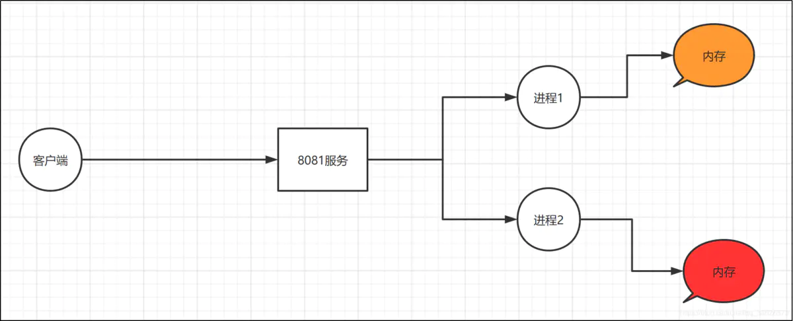  
 ### 多线程模式
 多线程方式和多进程方式很相似，服务器每接收到一个客户端请求时，会产生一个线程与该客户端进行交互。而产生一个线程的开销比进程小很多，所以多线程的方式在一定程度上减轻了web服务器对系统资源的要求  
 **缺点**是多线程之间存在内存共享、彼此间存在相互影响的情况  
  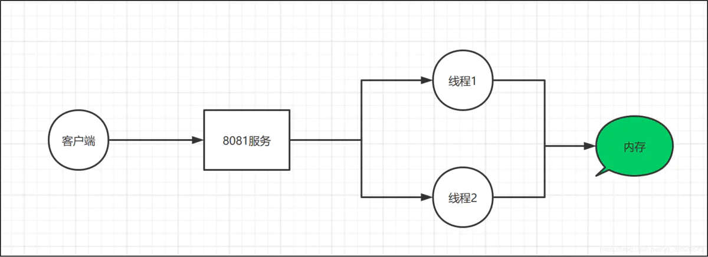  
### 异步模式
异步方式和前面说的两种方式完全不一样，关于异步这块，还有几个概念同步、异步； 阻塞、非阻塞  
#### 同步/异步
**同步机制**是指发送方发送请求后，需要等待接收方返回响应后，才能发送下一个请求  
**异步机制**发送方发送请求后，不等待接收方响应这个请求，就继续发送下个请求  
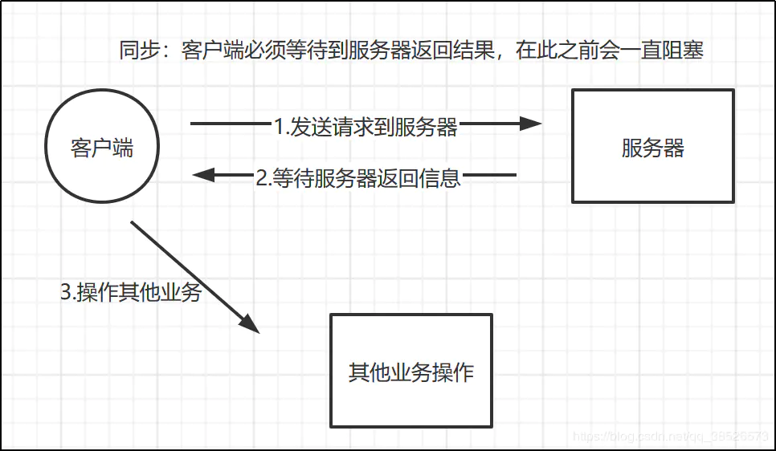  
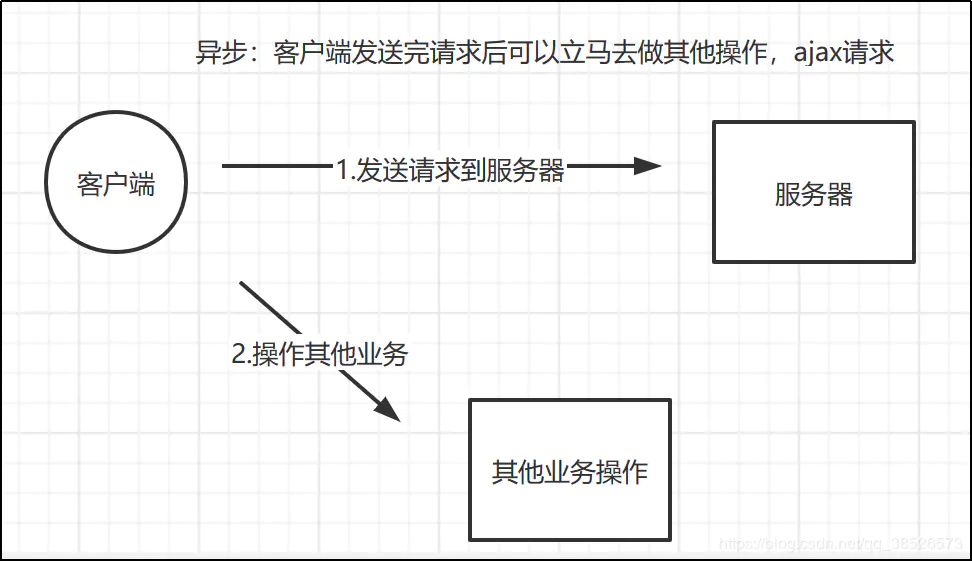  
#### 阻塞/非阻塞
主要指**socket读写数据**的阻塞和非阻塞方式  
Socket的本质其实也是IO操作。每一个TCP Socket的内核中都有一个发送缓冲区和接收缓冲区。对与阻塞模式来说，如果接收缓冲区为空，那么socket的read方法的线程就会阻塞，直到有数据进入接收缓冲区。而对于写数据到socket中而言，如果待发送的数据长度大于发送缓冲区的空余长度，那么write方法会进入阻塞  
#### 区别
同步异步与阻塞非阻塞的主要区别是针对**对象**不同  
**同步异步**是针对**调用者**来说的，调用者发起一个请求后，一直干等被调用者的反馈就是同步，不必等去做别的事就是异步  
**阻塞非阻塞**是针对**被调用者**来说的，被调用者收到一个请求后，做完请求任务后才给出反馈就是阻塞，收到请求直接给出反馈再去做任务就是非阻塞  
对于**非阻塞模式**来说，通过事件触发的方式来达到目的。我们可以认为NIO底层中存在一个**I/O调度线程**，它不断的扫描每个Socket的缓冲区，当发现写入缓冲区为空的时候，它会产生一个Socket可写事件，此时程序就可以把数据写入到Socket中。如果一次写不完，就等待下一次的可写事件通知；反之，当发现缓冲区里有数据的时候，它会产生一个Socket可读事件，程序收到这个通知事件就可以从Socket读取数据了  
#### 同步阻塞
发送方向接收方发送请求后，一直等待接收方响应；接收方在处理请求时进行的IO操作如果不能马上得到结果，就一直等待结果返回才响应发送方,期间一直处于阻塞状态  
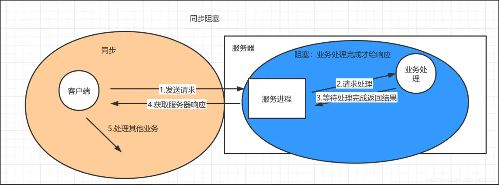
#### 同步非阻塞
发送方向接收方发送请求后，一直等待响应，接收方在进行IO操作的时候，可以不需要等待直接去做其他事，而因为还没有获得结果，发送方仍然处于等待状态。接收方获得io的操作完成后，把结果响应给发送方，接收方才进入下一次请求过程  
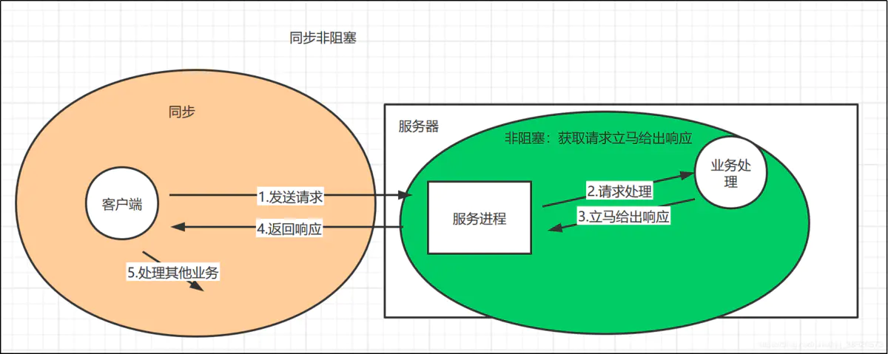
#### 异步阻塞
发送方向接收方发送请求后，不用等待响应，可以接着进行其他操作。接收方处理请求时进行的IO操作如果不能立刻获得结果，就一直等待返回结果后向发送方响应  

#### 异步非阻塞
发送方发送请求后，不用等待响应，可以继续做其他事情。接收方处理请求时进行的IO操作如果不能马上得到结果，也不等待，而是去做其他事情。当io操作完成后，把结果通知给接收方，接收方再响应给发送方  
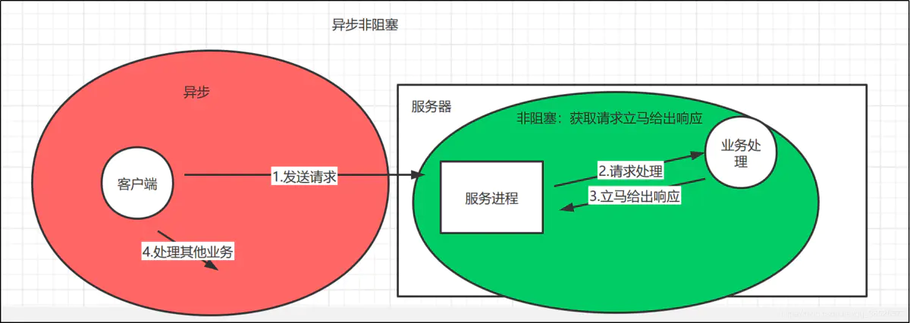
### Nginx服务器的请求处理过程
Nginx结合了**多进程机制**和**异步机制**对外提供服务
Nginx服务启动后，会产生一个**主进程**和多个**工作进程**  
**master进程**主要用来管理**worker进程**，包含：接收来自外界的信号，向各worker进程发送信号，监控worker进程的运行状态，当worker进程退出后(异常情况下)，会自动重新启动新的worker进程  
基本的网络事件，则是放在worker进程中来处理.多个worker进程之间是对等的，他们同等竞争来自客户端的请求，各进程互相之间是独立的。一个请求，只可能在一个worker进程中处理，一个worker进程，不可能处理其它进程的求，worker进程的个数是可以设置的，一般我们会设置与机器cpu核数一致  
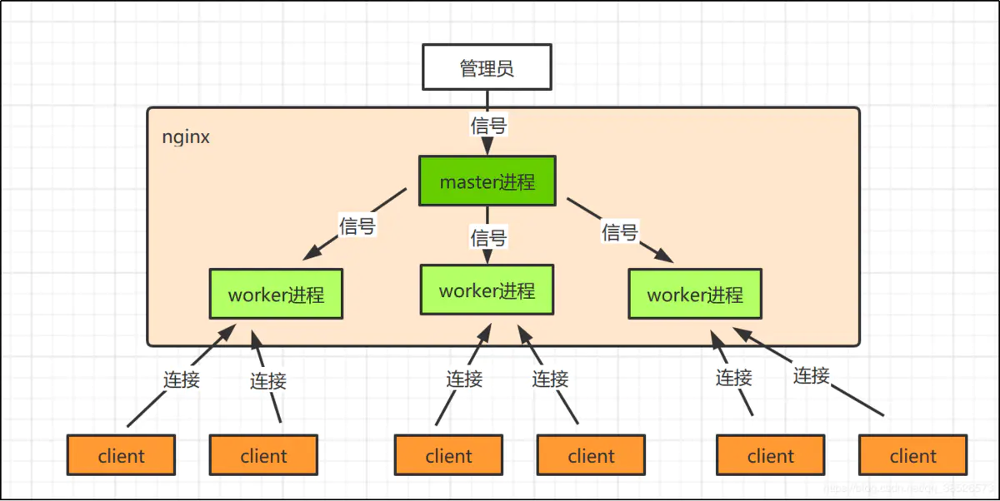
#### 热部署
master来管理worker进程，所以我们只需要与master进程通信就行了。master进程会接收来自外界发来的信号，再根据信号做不同的事情,比如我们前面常用的  
`./sbin/nginx -c conf/nginx.conf -s reload `
执行这个命令时，master收到这个信号以后先启动一个新的Nginx进程，而新的Nginx进程在解析到reload参数后，就知道是要控制Nginx来重新加载配置文件，它会向master进程发送信号，然后master会重新加载配置文件，在启动新的worker进程，并向所有老的worker进程发送信号，告诉他们可以退休了，新的worker启动之后就可以以新的配置文件接收新的请求  
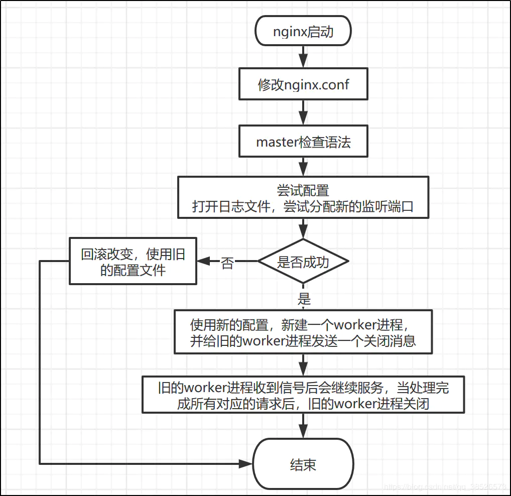
#### worker进程处理请求
基本上知道了在操作nginx时，nginx内部所做的事情，那么worker进程是如何处理请求的呢？ 在Nginx中，所有的worker进程都是平等的，每个进程处理每个请求的机会是一样的。当我们提供80端口的http服务时，一个连接请求过来，每个进程都可能处理这个连接  
worker进程是从master进程fork过来的，而在master进程中，会先建立好需要listen的socket，然后fork出多个worker进程，当有新连接请求过来时work进程可以去处理，为了避免惊群效应，worker进程在处理请求之前先要去抢占accept_mutex，也就是互斥锁，当获得锁成功以后，就可以去解析处理这个请求。请求处理完以后再返回给客户端  
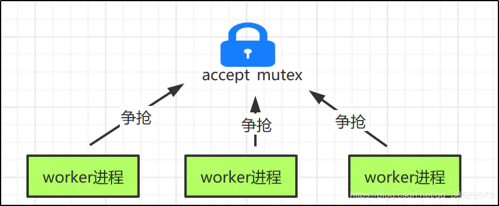  
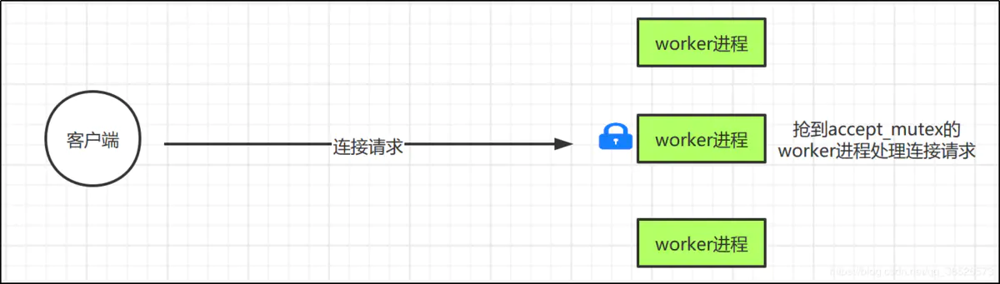  
进程模型的处理方式带来的一些好处就是：进程之间是独立的，也就是一个worker进程出现异常退出，其他worker进程是不会受到影响的；此外，独立进程也会避免一些不需要的锁操作，这样子会提高处理效率，并且开发调试也更容易  
worker进程会竞争监听客户端的连接请求：这种方式可能会带来一个问题，就是可能所有的请求都被一个worker进程给竞争获取了，导致其他进程都比较空闲，而某一个进程会处于忙碌的状态，这种状态可能还会导致无法及时响应连接而丢弃discard掉本有能力处理的请求。这种不公平的现象，是需要避免的，尤其是在高可靠web服务器环境下  
针对这种现象，Nginx采用了一个是否打开accept_mutex选项的值，ngx_accept_disabled标识控制一个worker进程是否需要去竞争获取accept_mutex选项，进而获取accept事件  
>>ngx_accept_disabled值：nginx单进程的所有连接总数的八分之一，减去剩下的空闲连接数量，得到的这个ngx_accept_disabled。
  当ngx_accept_disabled大于0时，不会去尝试获取accept_mutex锁，并且将ngx_accept_disabled减1，于是，每次执行到此处时，都会去减1，直到小于0。不去获取accept_mutex锁，就是等于让出获取连接的机会，很显然可以看出，当空闲连接越少时，ngx_accept_disable越大，于是让出的机会就越多，这样其它进程获取锁的机会也就越大。不去accept，自己的连接就控制下来了，其它进程的连接池就会得到利用，这样，nginx就控制了多进程间连接的平衡了
## Nginx配置文件的整体结构
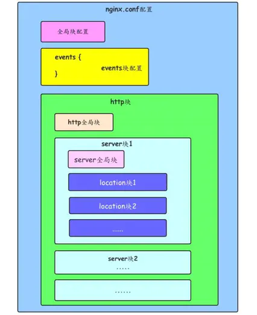
### Nginx配置文件具体内容
#### 全局块
该部分配置主要影响Nginx全局，通常包括下面几个部分:  
     
     配置运行Nginx服务器用户（组）
     
     worker process数
     
     Nginx进程PID存放路径
     
     错误日志的存放路径
     
     配置文件的引入
#### events块
该部分配置主要影响Nginx服务器与用户的网络连接，主要包括:  
     
     设置网络连接的序列化
     
     是否允许同时接收多个网络连接
     
     事件驱动模型的选择
     
     最大连接数的配置
#### http块
     
     定义MIMI-Type
     
     自定义服务日志
     
     允许sendfile方式传输文件
     
     连接超时时间
     
     单连接请求数上限
#### server块
     
     配置网络监听
     
     基于名称的虚拟主机配置
     
     基于IP的虚拟主机配置
#### location块
     
     location配置
     
     请求根目录配置
     
     更改location的URI
     
     网站默认首页配置
### 配置解析
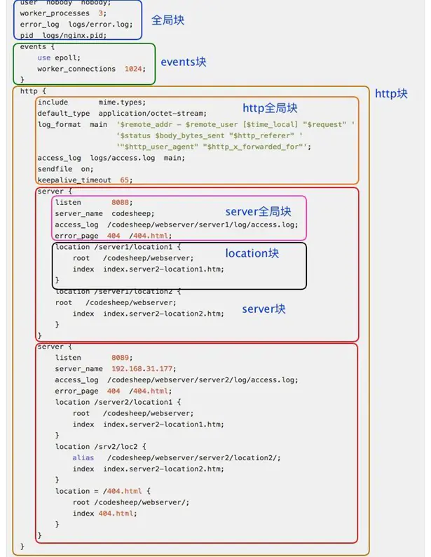 
