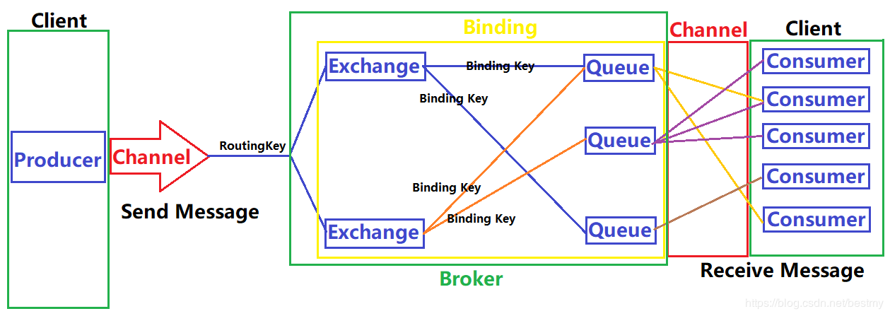

#RabbitMQ 学习笔记
##基础概念
通常我们在谈到消息队列的时候，会有三个概念：发消息者，消息队列，收消息者。  
然而RabbitMQ在这个基础上新增一层抽象，在发消息者和队列之间加入了交换器（Exchange）的概念。这样发消息者和消息队列就没有直接队列联系，转而使变成发消息者将消息交给交换器，交换器根据调度策略再把消息转给消息队列。  
 
 1、channel:（通道）多路复用连接中一条独立的双向数据流通道，信息使建立在真实的TCP内的虚拟连接  
 2、Producer:(生产者)向消息队列发布信息的客户端应用程序  
 3、Consumer：（消费者）从消息队列中取得信息的客户端应用程序  
 4、Message：（消息）消息由消息头和消息体组成  
 5、Routing Key：消息头的一个属性，用于标记信息的路由规则，决定交换机的转发路径，最大长度255字节  
 6、Queue：（消息队列）存储信息的一种数据结构，用来保存信息，直到信息发送给消费者，一个消息可投入一个或多个队列，消息一直在队列里面，等待消费者连接到这个队列将消息取走。需要注意的是，当多个消费者订阅同一个Queue的时候，Queue中队列会被平均分摊到多个消费者处理，而不是每一个消费者都收到消息处理。每一条消息只能一个消费者处理  
 7、Exchange：（交换器）提供Producer到Queue的匹配，接受生产者发送的消息，并将这些消息按照路由规则转发到对应的消息队列中，交换器只会转发消息，它不会存储消息，如果没有Queue的绑定Exchange的话，它会直接丢弃掉生产者发送过来的信息  
 8、Binding:(绑定)用于建立Exchange和Queue之间的关联，一个绑定就是基于Binding key将Exchange和Queue连接起来的路由规则。
 ## Exchange 消息调度策略
 调度策略与三个因素有关：Exchange Type（Exchange类型），Binding Key（Exchange和Queue的绑定关系），消息的标记信息。  
 Exchange根据消息的Routing key和Exchange绑定的Queue的Binding Key分配信息。生产者将信息发送给Exchange的时候，一般会指定Routing key时，来指定这个消息的路由规则，而这个Routing key需要与Exchange Type以及Binding key的联合使用  
 ### Fanout
 交换器会把所有发送到该交换器的信息路由到所有与该交换器绑定的信息队列中，订阅模式与Routing key，banding key无关，交换器将接收到信息分发给所有绑定了的消息队列。  
 Fanout 交换机转发消息是最快的
 ### Direct(路由模式)
 精确匹配：当消息的Routing key和Binding key完全匹配，如果匹配成功则将消息发到该queue中  
 Direct是Exchange的默认模式，RabbitMQ默认提供了一个Exchange，名字是空字符串，类型是Direct
 ### Topic（通配符模式）
 按照正则表达式模糊匹配，用消息的routing key和binding key 进行模糊匹配，如果匹配成功则将该消息发送给队列。
 ### Headers 键值对模式
 Headers不依赖于routing key和binding key的匹配规则转发消息，交换器的路由规则是通过消息头headers属性  
 键值对的一个Hash结构中要求携带一个键"x-match",这个键的value可以是any也可以是all，any表示匹配任何一个键值对，all表示完全匹配
 ## RPC 远程过程调用
 MQ本身是基于异步消息处理，在最基本的实例中，生产者将消息发送到RabbitMQ之后完全无法知道消费者处理成功或者失败，甚至连有没有消费者来处理这条消息都不知道。  
 1、生产者发送请求，在消息的属性中定义两个值，replyTo（Queue名称），correlationId(此次请求的标识符)  
 2、消费者收到消息并处理  
 3、消费者处理完消息，将生成一条应答消息到replyTo指定的Queue，同时带上correlationId属性  
 4、生产者之前已订阅replyTo指定的Queue，从中收到服务器的应答信息后，根据其中的correlationId属性分析哪条请求被执行
## 消息确认（Message Ackonwledgment）

 
 