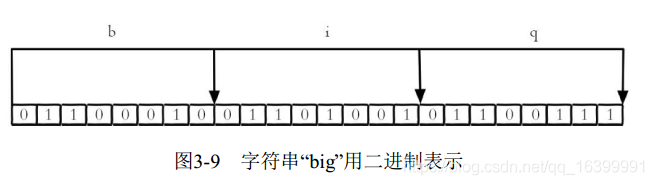
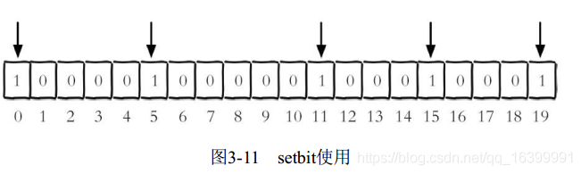
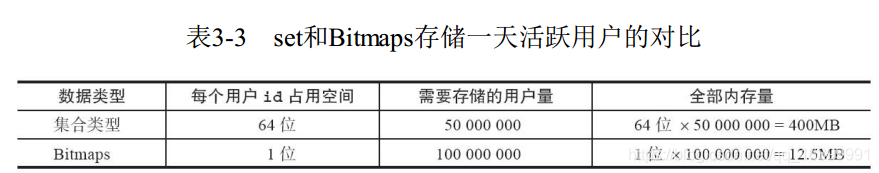
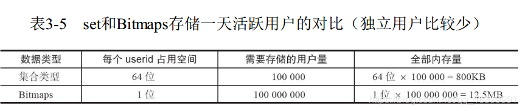
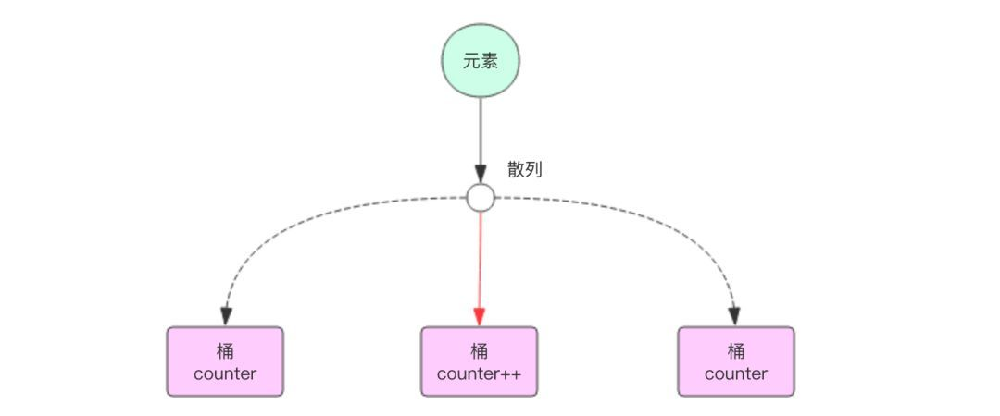

# Redis 学习笔记
 在日常开发过程中，无不都是使用数据库进行操作的存储，由于一般的系统任务中不会存在高并发的情况，当遇到主页访问量增大时，磁盘的读写速度慢而存在严重的弊端。  
 NoSql技术就是克服以上问题而引入的，这是一种基于内存的数据库，并且提供一定的持久化功能。  
 Redis和MongoDB是当前使用的最广泛的NoSql技术，而就Redis而言，它的性能十分优越，可以支持十几万次的读写操纵，还支持集群，分布式，主从同步等配置。
 ## 三大特点
       1.Redis 支持数据的持久化，可以将内存中的数据保存在磁盘中，重启的时候可以再次加载进行使用
       
       2.Redis 不仅仅支持简单的 key-value 类型的数据，同时还提供 list，set，zset，hash 等数据结构的存储
       
       3.Redis 支持数据的备份，即 master-slave(主从) 模式的数据备份
       
 ## Redis 优势
       1.性能极高 – Redis 能读的速度是 110000 次/s,写的速度是 81000 次/s
       
       2.丰富的数据类型 – Redis 支持二进制案例的 Strings, Lists, Hashes, Sets 及Ordered Sets 数据类型操作
       
       3.原子 – Redis 的所有操作都是原子性的，意思就是要么成功执行要么失败完全不执行。单个操作是原子性的。多个操作也支持事务，即原子性，通过 MULTI 和 EXEC指令包起来
       
       4.丰富的特性 – Redis 还支持 publish/subscribe, 通知, key 过期等等特性
 ## Redis应用场景--数据类型
 ### string类型
 作为常规的key-value缓存应用，主要是用于计数使用，例如微博数，粉丝数等  
 **注：一个键的最大值是512mb**
 #### 基础命令
 ##### 添加或修改数据
  ```set key value```
 ##### 获取数据
 ```get key```  
 ##### 删除数据
 ```del key```
 ##### 设置过期时间(默认单位为秒)
 ```expire key second```
 ##### 添加/修改多个数据
 ```mset key1 value1 key2 value2...```
 ##### 获取多个数据
 ```mget key1 key2 ...```
 ### hash类型
 redis hash是一个string类型的field和value的映射表，hash特别适用于存储对象（因为对象可以包含多种属性）  
 #### 基础命令
 ##### 添加/修改数据
 ```hset key field value``` 
 ##### 获取数据
 ```
hget key field 
hgetall key
```
##### 删除数据
```hdel key field [field2 ...]```
##### 添加或删除多个数据
```hmset key field1 value1 field2 value2 ...```
##### 获取多个数据
```hmget key field1 field2 ...```
##### 获取hash表中是否存在指定的字段
```hexists key field```
 **主要用来存储对象信息**  
 ### list类型
 list只是简单字符串列表，按照插入的顺序进行排序（由LinkedList内部实现），可以选择将一个链表插入到头部或者尾部  
 常用命令 :lpush（添加左边元素）,rpush,lpop（移除左边第一个元素）,rpop,lrange（获取列表片段，LRANGE key start stop）等  
 应用场景：Redis list的应用场景非常多，也是Redis最重要的数据结构之一，比如twitter的关注列表，粉丝列表等都可以用Redis的list结构来实现
 ### set类型
 对外提供的是与list相同的一个列表功能，特殊之处在于set可以自动去重，set提供了判断某个元素是否在set集合内，可以基于set轻易实现交集，并集，差集等操作  
 应用场景：在微博中，可以将一个用户所有的关注人存在一个集合中，将其所有粉丝存在一个set集合，可以非常方便的实现如共同关注、共同喜好、二度好友等功能，对上面的所有集合操作，你还可以使用不同的命令选择将结果返回给客户端还是存集到一个新的集合中
 ### zset类型（sorted set）
 Redis sorted set的内部使用HashMap和跳跃表(SkipList)来保证数据的存储和有序。zset相对于set增加了一个score的权重参数，HashMap里放的是成员到score的映射，跳跃表按score从小到大保存所有集合元素。使用跳跃表的结构可以获得比较高的查找效率，并且在实现上比较简单。时间复杂度与红黑树相同O(logn)，增加、删除的操作较为简单  
 应用场景：排行榜
 ## Redis应用场景--特殊数据类型
 ### Bitmaps
 现代计算机用二进制（位） 作为信息的基础单位， 1个字节等于8位， 例如“big”字符串是由3个字节组成， 但实际在计算机存储时将其用二进制表示， “big”分别对应的ASCII码分别是98、 105、 103， 对应的二进制分别是01100010、 01101001和01100111  
   
 许多开发语言都提供了操作位的功能， 合理地使用位能够有效地提高内存使用率和开发效率。 Redis提供了Bitmaps这个"**数据结构**"可以实现对位的操作  
 **注意:**  
       1.Bitmaps本身不是一种数据结构， 实际上它就是字符串， 但是它可以对字符串的位进行操作。  
       2.Bitmaps单独提供了一套命令， 所以在Redis中使用Bitmaps和使用字符串的方法不太相同。**可以把Bitmaps想象成一个以位为单位的数组， 数组的每个单元只能存储0和1， 数组的下标在Bitmaps中叫做偏移量**
  #### Bitmaps 设置值
  ``setbit key offset value``   
  设置键的第offset个位的值（**从0算起,值只能为0或1**），假设现在有20个用户，userid=0， 5， 11， 15， 19的用户对网站进行了访问, 那么当前Bitmaps初始化结果如下图  
    
  具体操作过程如下， unique： users： 2016-04-05代表2016-04-05这天的独立访问用户的Bitmaps  
 ```
127.0.0.1:6379> setbit unique:users:2016-04-05 0 1
(integer) 0
127.0.0.1:6379> setbit unique:users:2016-04-05 5 1
(integer) 0
127.0.0.1:6379> setbit unique:users:2016-04-05 11 1
(integer) 0
127.0.0.1:6379> setbit unique:users:2016-04-05 15 1
(integer) 0
127.0.0.1:6379> setbit unique:users:2016-04-05 19 1
(integer) 0
```
 #### Bitmaps 获取值
 ``getbit key offset``  
 获取键的第offset位的值（从0开始算,**不存在的offset返回值也为0**） ， 例:下面操作获取id=8的用户是否在2016-04-05这天访问过， 返回0说明没有访问过
 ```
127.0.0.1:6379> getbit unique:users:2016-04-05 8
(integer) 0
```
  #### Bitmaps 获取指定范围内的个数
  ``bitcount [start][end]``  
  下面操作计算2016-04-05这天的独立访问用户数量：  
  ```
127.0.0.1:6379> bitcount unique:users:2016-04-05
(integer) 5
```
  \[start]以及\[end]代表的是开始字节以及结束字节(**字节占8位**),下面操作计算用户id在第1个字节到第3个字节之间的独立访问用户数， 对应的用户id是11， 15， 19
  ```
127.0.0.1:6379> bitcount unique:users:2016-04-05 1 3
(integer) 3
```
 #### Bitmaps 分析
 假设网站有1亿用户， 每天独立访问的用户有5千万， 如果每天用集合类型和Bitmaps分别存储活跃用户可以得到如下图所示的表  
   
 很明显,在活跃用户较大的情况下,那么使用Bitmaps能够节约足够多的空间,且查询速度也更加快速  
 **当用户活跃数少的时候,反而使用集合类型更加节约空间**  
 
 ### HyperLogLog
 HyperLogLog算法是一种非常巧妙的近似统计海量去重元素数量的算法。它内部维护了 16384 个桶（bucket）来记录各自桶的元素数量。当一个元素到来时，它会散列到其中一个桶，以一定的概率影响这个桶的计数值。因为是概率算法，所以单个桶的计数值并不准确，但是将所有的桶计数值进行调合均值累加起来，结果就会非常接近真实的计数值  
   
 **举个例子：**  
 >假如我要统计网页的UV（浏览用户数量，一天内同一个用户多次访问只能算一次），传统的解决方案是使用Set来保存用户id，然后统计Set中的元素数量来获取页面UV。但这种方案只能承载少量用户，一旦用户数量大起来就需要消耗大量的空间来存储用户id。我的目的是统计用户数量而不是保存用户，这简直是个吃力不讨好的方案！而使用Redis的HyperLogLog最多需要12k就可以统计大量的用户数，尽管它大概有0.81%的错误率，但对于统计UV这种不需要很精确的数据是可以忽略不计的
 #### HyperLogLog 基数统计
 一个集合（注意：这里集合的含义是 Object 的聚合，可以包含重复元素）中不重复元素的个数。例如集合 {1,2,3,1,2}，它有5个元素，但它的基数/Distinct 数为3  
 Redis 最常用的数据结构有字符串、列表、字典、集合和有序集合。后来，由于 Redis 的广泛应用，Redis 自身也做了很多补充，其中就有 HyperLogLog（2.8.9 版本添加）结构。HyperLogLog 是用来做基数统计的算法，HyperLogLog 的优点是，在输入元素的数量或者体积非常大时，计算基数所需的空间总是固定的、并且是很小的  
 #### Redis HyperLogLog结构
 在 Redis 中每个键占用的内容都是 12K，理论存储近似接近 2^64 个值，不管存储的内容是什么。这是一个基于基数估计的算法，只能比较准确的估算出基数，可以使用少量固定的内存去存储并识别集合中的唯一元素。但是这个估算的基数并不一定准确，是一个带有 0.81% 标准错误（standard error）的近似值  
 **但是，也正是因为只有 12K 的存储空间，所以，它并不实际存储数据的内容**
 #### Redis HyperLogLog命令
 ##### PFADD 命令
 将任意数量的元素添加到指定的 HyperLogLog 里面。时间复杂度： 每添加一个元素的复杂度为 O(1) 。如果 HyperLogLog 估计的近似基数（approximated cardinality）在命令执行之后出现了变化， 那么命令返回 1 ， 否则返回 0 。 如果命令执行时给定的键不存在， 那么程序将先创建一个空的 HyperLogLog 结构， 然后再执行命令  
 ```
 # 命令格式：PFADD key element [element …]
 # 如果给定的键不存在，那么命令会创建一个空的 HyperLogLog，并向客户端返回 1
 127.0.0.1:6379> PFADD ip_20190301 "192.168.0.1" "192.168.0.2" "192.168.0.3"
 (integer) 1
 # 元素估计数量没有变化，返回 0（因为 192.168.0.1 已经存在）
 127.0.0.1:6379> PFADD ip_20190301 "192.168.0.1"
 (integer) 0
 # 添加一个不存在的元素，返回 1。注意，此时 HyperLogLog 内部存储会被更新，因为要记录新元素
 127.0.0.1:6379> PFADD ip_20190301 "192.168.0.4"
 (integer) 1
```
 ##### PFCOUNT 命令
 当 PFCOUNT key [key …] 命令作用于单个键时，返回储存在给定键的 HyperLogLog 的近似基数，如果键不存在，那么返回 0，复杂度为 O(1)，并且具有非常低的平均常数时间;  
 当 PFCOUNT key [key …] 命令作用于多个键时，返回所有给定 HyperLogLog 的并集的近似基数，这个近似基数是通过将所有给定 HyperLogLog 合并至一个临时 HyperLogLog 来计算得出的，复杂度为 O(N)，常数时间也比处理单个 HyperLogLog 时要大得多  
 ```
# 返回 ip_20190301 包含的唯一元素的近似数量
127.0.0.1:6379> PFCOUNT ip_20190301
(integer) 4
127.0.0.1:6379> PFADD ip_20190301 "192.168.0.5"
(integer) 1
127.0.0.1:6379> PFCOUNT ip_20190301
(integer) 5
127.0.0.1:6379> PFADD ip_20190302 "192.168.0.1" "192.168.0.6" "192.168.0.7"
(integer) 1
# 返回 ip_20190301 和 ip_20190302 包含的唯一元素的近似数量
127.0.0.1:6379> PFCOUNT ip_20190301 ip_20190302
(integer) 7
```
 ##### PFMERGE 命令
 将多个 HyperLogLog 合并（merge）为一个 HyperLogLog，合并后的 HyperLogLog 的基数接近于所有输入 HyperLogLog 的可见集合（observed set）的并集。时间复杂度是 O(N)，其中 N 为被合并的 HyperLogLog 数量，不过这个命令的常数复杂度比较高  
 命令格式：PFMERGE destkey sourcekey [sourcekey …]，合并得出的 HyperLogLog 会被储存在 destkey 键里面，如果该键并不存在，那么命令在执行之前，会先为该键创建一个空的 HyperLogLog  
 ```
# ip_2019030102 是 ip_20190301 与 ip_20190302 并集
127.0.0.1:6379> PFMERGE ip_2019030102 ip_20190301 ip_20190302
OK
127.0.0.1:6379> PFCOUNT ip_2019030102
(integer) 7
```
 ##### Redis HyperLogLog的应用场景
 鉴于 HyperLogLog 不保存数据内容的特性，所以，它只适用于一些特定的场景。一个最常遇到的场景需要：**计算日活、7日活、月活数据**  
 **分析：**  
 >如果我们通过解析日志，把 ip 信息（或用户 id）放到集合中，例如：HashSet。如果数量不多则还好，但是假如每天访问的用户有几百万。无疑会占用大量的存储空间。且计算月活时，还需要将一个整月的数据放到一个 Set 中，这随时可能导致我们的程序 OOM
 **如果需要统计月活或者更多的数据,那么只需要将日活跃人数合并在进行统计即可**
 ### GEO
 GEO功能在Redis3.2版本提供，支持存储地理位置信息用来实现诸如附近位置、摇一摇这类依赖于地理位置信息的功能.**geo的数据类型为zset**  
 #### GEOADD 命令
 将给定的空间元素（纬度、经度、名字）添加到指定的键里面  
 这些数据会以有序集合的形式被储存在键里面，从而使得像GEORADIUS和GEORADIUSBYMEMBER这样的命令可以在之后通过位置查询取得这些元素  
 命令demo：GEOADD key longitude(经度) latitude(纬度) member(地点名称) \[longitude latitude member ...](**注意:只能先保存经度再是维度的顺序**)  
 命令描述：将指定的地理空间位置（纬度、经度、名称）添加到指定的key中  
 返回值：添加到sorted set元素的数目，但不包括已更新score的元素
 ```
geoadd cityGeo 116.405285 39.904989 "北京"
geoadd cityGeo 121.472644 31.231706 "上海"
```
 #### GEODIST 命令
 返回两个给定位置之间的距离。如果两个位置之间的其中一个不存在， 那么命令返回空值  
 指定单位的参数 unit 必须是以下单位的其中一个:m 表示单位为米、km 表示单位为千米、mi 表示单位为英里、ft 表示单位为英尺(**不指定unit,则默认为m米**)  
 **GEODIST 命令在计算距离时会假设地球为完美的球形，在极限情况下， 这一假设最大会造成 0.5% 的误差**  
 ```
127.0.0.1:6379> geodist cityGeo 北京 上海
"1067597.9668"
127.0.0.1:6379> geodist cityGeo 北京 上海 km
"1067.5980"
```
 #### GEOPOS 命令
 从键里面返回所有给定位置元素的位置（经度和纬度）。因为 GEOPOS 命令接受可变数量的位置元素作为输入， 所以即使用户只给定了一个位置元素， 命令也会返回数组回复。GEOPOS 命令返回一个数组， 数组中的每个项都由两个元素组成： 第一个元素为给定位置元素的经度， 而第二个元素则为给定位置元素的纬度。 当给定的位置元素不存在时， 对应的数组项为空值  
 ```
127.0.0.1:6379> geopos cityGeo 北京
1) 1) "116.40528291463851929"
   2) "39.9049884229125027"
```
 #### GEOHASH 命令
 返回一个或多个位置元素的 Geohash 表示。返回值：一个数组， 数组的每个项都是一个 geohash 。 命令返回的 geohash 的位置与用户给定的位置元素的位置一一对应  
 ```
127.0.0.1:6379> geohash cityGeo 北京
1) "wx4g0b7xrt0"
```
 #### GEORADIUS 命令
 以给定的经纬度为中心， 返回键包含的位置元素当中， 与中心的距离不超过给定最大距离的所有位置元素。范围可以使用以下其中一个单位：m 表示单位为米。km 表示单位为千米。mi 表示单位为英里。ft 表示单位为英尺  
 **在给定以下可选项时， 命令会返回额外的信息:**  
 
     * WITHDIST：在返回位置元素的同时， 将位置元素与中心之间的距离也一并返回。 距离的单位和用户给定的范围单位保持一致
     
     * WITHCOORD：将位置元素的经度和维度也一并返回
     
     * WITHHASH ： 以 52 位有符号整数的形式， 返回位置元素经过原始 geohash 编码的有序集合分值。 这个选项主要用于底层应用或者调试， 实际中的作用并不大
     
  **命令默认返回未排序的位置元素。 通过以下两个参数， 用户可以指定被返回位置元素的排序方式：**
  
     * ASC ： 根据中心的位置， 按照从近到远的方式返回位置元素
     
     * DESC ： 根据中心的位置， 按照从远到近的方式返回位置元素
  在默认情况下， GEORADIUS 命令会返回所有匹配的位置元素。 虽然用户可以使用 COUNT 选项去获取前 N 个匹配元素， 但是因为命令在内部可能会需要对所有被匹配的元素进行处理， 所以在对一个非常大的区域进行搜索时， 即使只使用 COUNT 选项去获取少量元素， 命令的执行速度也可能会非常慢。 但是从另一方面来说， 使用 COUNT 选项去减少需要返回的元素数量， 对于减少带宽来说仍然是非常有用的  
  `georadius cityGeo 116.405285 39.904989 100 km WITHDIST WITHCOORD ASC COUNT 5`
  #### GEORADIUSBYMEMBER 命令
  这个命令和 GEORADIUS 命令一样， 都可以找出位于指定范围内的元素， 但是 GEORADIUSBYMEMBER 的中心点是由给定的位置元素决定的， 而不是像 GEORADIUS 那样， 使用输入的经度和纬度来决定中心点  
  `georadiusbymember cityGeo 北京 100 km WITHDIST WITHCOORD ASC COUNT 5`
  ### BloomFilter
 BloomFilter是一种空间效率的概率型数据结构，由Burton Howard Bloom 1970年提出的。通常用来判断一个元素是否在集合中。具有极高的空间效率，但是会带来假阳性(False positive)的错误  
 **False positive**  
 BloomFilter在判断一个元素在集合中的时候，会出现一定的错误率，这个错误率称为False positive的。通常缩写为fpp  
 **False negatives**  
 BloomFilter判断一个元素不在集合中的时候的错误率。BloomFilter判断该元素不在集合中，则该元素一定不再集合中。故False negatives概率为0
 #### 算法描述
 BloomFilter使用长度为m bit的字节数组，使用k个hash函数  
 增加一个元素: 通过k次hash将元素映射到字节数组中k个位置中，并设置对应位置的字节为1  
 查询元素是否存在: 将元素k次hash得到k个位置，如果对应k个位置的bit是1则认为存在，反之则认为不存在  
 #### BloomFilter命令
 ```
127.0.0.1:6379> bf.add codehole user1
(integer) 1
127.0.0.1:6379> bf.add codehole user2
(integer) 1
127.0.0.1:6379> bf.add codehole user3
(integer) 1
127.0.0.1:6379> bf.exists codehole user1
(integer) 1
127.0.0.1:6379> bf.exists codehole user2
(integer) 1
127.0.0.1:6379> bf.exists codehole user3
(integer) 1
127.0.0.1:6379> bf.exists codehole user4
(integer) 0
127.0.0.1:6379> bf.madd codehole user4 user5 user6
1) (integer) 1
2) (integer) 1
3) (integer) 1
127.0.0.1:6379> bf.mexists codehole user4 user5 user6 user7
1) (integer) 1
2) (integer) 1
3) (integer) 1
4) (integer) 0
```
>bf.reserve创建Filter，语法：[bf.reserve key error_rate initial_size]，需要注意的是：布隆过滤器的initial_size估计的过大，所需要的空间就越大，会浪费空间，估计的过小会影响准确率，因此在使用前一定要估算好元素数量，还需要加上一定的冗余空间以避免实际元素高出预估数量造成误差过大。布隆过滤器的error_rate越小，所需要的空间就会越大，对于不需要过于准确的，error_rate设置的稍大一点也无所谓
 ## Redis删除机制
 Redis在set key的时候，可以额外给一个expire的参数，这是设置过期时间的
 ### 定时删除
 在设置键的过期时间的同时，创建一个定时器 (timer). 让定时器在键的过期时间来临时，立即执行对键的删除操作
 ### 定期删除
 Redis内部维护一个定时任务，默认每隔100毫秒会从过期字典中随机取出20个key，删除过期的key，如果过期key的比例超过了25%，则继续获取20个key，删除过期的key，循环往复，直到过期key的比例下降到25%或者这次任务的执行耗时超过了25毫秒，才会退出循环。  
 随机检查过期删除的原因在于，每隔100ms就检查所有的key，会造成巨大的资源消耗
 **Redis的主动过期的定时任务，也是在Redis主线程中执行的，也就是说如果在执行主动过期的过程中，出现了需要大量删除过期key的情况，那么在业务访问时，必须等这个过期任务执行结束，才可以处理业务请求。此时就会出现，业务访问延时增大的问题，最大延迟为25毫秒**
 ### 惰性删除
 定期删除可能会造成某些已经过期的key未被删除，那么当用户请求某个key的时候，Redis会检查此时key是否已经过期，如果已经过期则会删除
 ## 内存淘汰机制
 - volatile-lru:从已被设置了过期的数据集中挑选最近最少使用的进行淘汰
 - volatile-ttl:从已被设置了过期的数据集中选取即将要过期的进行随机淘汰
 - volatile-random:从已被设置了过期的数据集中随机选取数据进行淘汰
 - allkeys-lru:当内存空间不足以容纳新的数据时，从已存在的数据集中选取最少使用的数据进行淘汰
 - allkeys-random：当内存空间不足以容纳新的数据时，从已存在的数据集中随机选取数据进行淘汰
 - no-evicion:禁止驱逐，内存空间不足时报错
 ### 内存淘汰机制 使用规则
    1.如果数据呈现幂律分布，也就是一部分数据访问频率高，一部分数据访问频率低，则使用 allkeys-lru
    
    2.如果数据呈现平等分布，也就是所有的数据访问频率都相同，则使用allkeys-random
 ## Redis持久化机制
 ###快照持久层（RDB-Redis DataBase）
 Redis可以通过快照来获得内存中某个数据在某个时间点的副本.Redis创建快照之后，可以对快照进行备份,可以将快照复制到其他服务器从而创建相同数据的服务器副本，还可以将快照留在原地以便重启时使用  
 save 900 1 在900秒内有一个key发生变化，创建快照  
 save 300 10 在300秒内有十个key发生变化，创建快照  
 save 60 10000 在60秒内有10000个key发生变化，创建快照
 #### 优点
    1.只有一个文件 dump.rdb，方便持久化
    
    2.容灾性好，一个文件可以保存到安全的磁盘
    
    3.性能最大化，fork 子进程来完成写操作，让主进程继续处理命令，所以是IO最大化。使用单独子进程来进行持久化，主进程不会进行任何 IO 操作，保证了 redis的高性能
    
    4.相对于数据集大时，比 AOF 的启动效率更高
  #### 缺点
    1.数据安全性低。RDB 是间隔一段时间进行持久化，如果持久化之间 redis 发生故障，会发生数据丢失。所以这种方式更适合数据要求不严谨的时候
 ### AOF(append-only file)持久化
 在默认情况下未开启，在config文件中修改appendOnly为yes即可  
 AOF文件中的保存位置和RDB位置相同，每当有一条对数据进行更改的命令，Redis就会将此命令写入AOF文件中，默认名为appendOnly.aof  
 appendSync always 每次有数据更改的时候就将此命令写入AOF文件，但会降低redis的速度  
 appendSync everysec 每秒同步一次，显示将多个命令写入磁盘（推荐）  
 appendSync no 让操作系统决定同步  
 AOF重写：在执行BGREWRITEAOF时，Redis服务器会维护一个AOF重写缓冲区，该缓冲区会在子进程创建AOF文件期间，记录服务器执行的所有写命令。当进程完成创建AOF文件的工作之后，服务器会将重写缓冲区中所有内容追加到AOF文件中，使得新旧AOF文件中保持一致。
 #### 优点
     1.数据安全，aof 持久化可以配置 appendfsync 属性，有 always，每进行一次命令操作就记录到 aof 文件中一次
     
     2.通过 append 模式写文件，即使中途服务器宕机，可以通过 redis-check-aof工具解决数据一致性问题
 ### RDB和AOF的对比
 - aof文件比rdb文件大，且恢复速度慢
 - aof文件比rdb更新频率更高，优先使用aof持久化数据
 - aof文件比rdb更安全
 - rdb性能比aof好
 - 两个都配了应选aof
 ## Redis架构模式
 ### 单机版模式
 
 缺点：1、内存容量有限2、处理能力有限3、无法高可用
 ### 主从复制
  
  redis的复制功能允许用户根据一个Redis服务器例创建任意多个该服务的复制品，其中被复制的主服务器，复制出来的是从服务器。 只要主从服务器之间的网络连接正常，主从服务器两者会具有相同的数据，主服务器就会一直将发生在自己身上的数据更新同步 给从服务器，从而一直保证主从服务器的数据相同。  
  优点：降低master读压力在转交给从库
  缺点：1、无法保证高可用2、没有解决master写压力
  ### 哨兵模式
   
   Redis sentinel是一个分布式监控，Redis主从服务器，并在主服务器下线时自动进行故障转移。  
   - 监控：sentinel会不间断的检查主服务器和从服务器是否运行正常
   - 提醒：当被监控的某个redis服务器出现问题时，sentinel可以通过API向管理员或其他应用程序发送通知
   - 自动故障转移：当一个主服务器不能正常工作时，sentinel会自动进行故障转移
   缺点：1、主从模式，却换需要时间可能丢失数据2、没有解决master写的压力
  ## Redis常见问题
  ### 缓存穿透
  一般的缓存系统，都是按照key去缓存查询的，如果不存在对应的value，就应该去后端数据库查询。但是一些恶意的请求会故意查询不存在的key，请求量大的情况下，就会对后端系统造成巨大压力。  
  如何避免：  
  1、对查询结果为空的情况也进行缓存，缓存时间设置短一点，或者该key对应的数据insert之后对应缓存  
  2、对一定不存在的key进行过滤，可以把所有可能存在的key放在bitmap里面（**推荐**）
  ### 缓存雪崩
  当服务器重启或大量缓存集中在同一时间段生效，这样在失效的时候，会给后端带来巨大压力，可能导致系统崩溃  
  如何避免：  
  1、在缓存失效之后，通过加锁或者队列来控制读数据库写缓存的线程数量，比如对某一个key只允许一个线程查询数据和写数据，其他线程等等  
  2、做二级缓存，A1为原始缓存，A2为拷贝数据，A1失效可以访问A2  
  3、不同的key设置不同的是失效时间，做到尽量数据时间均衡  
  ### 缓存预热
  当系统刚刚上线的时候，将相关的缓存数据直接加载到缓存系统，这样就可以避免在用户请求的时候，先查询数据库，然后再将数据缓存的问题
  如何避免：  
  1、可以直接写个缓存页面，上线时手工操作一下  
  2、数据量不多时，可以在项目启动时自动加载  
  3、定时刷新缓存  
  ## Memcashe和Redis的区别
  1、Memcashe将数据全保存在内存中，断电后关掉，不能持久化  
  2、Memcashe所有的值类型全是string类型，而redis则是string，hash，list，set，zset  
  3、Redis直接构建了自己的vm机制，因为一般情况下系统调用系统函数，会浪费一定的资源以及时间  
  4、value值不同：Redis可以达到1G，而Memcashe只有1m
  5、Redis速度比Memcashe快很多
  6、Redis支持数据备份
  ## Redis延迟问题定位以及分析
  ### 使用复杂度高的命令
  首先，第一步，建议你去查看一下Redis的慢日志。Redis提供了慢日志命令的统计功能，我们通过以下设置，就可以查看有哪些命令在执行时延迟比较大.  
  首先设置Redis的慢日志阈值，只有超过阈值的命令才会被记录，这里的单位是微妙，例如设置慢日志的阈值为5毫秒，同时设置只保留最近1000条慢日志记录.
  ```
  # 命令执行超过5毫秒记录慢日志
  CONFIG SET slowlog-log-slower-than 5000
  # 只保留最近1000条慢日志
  CONFIG SET slowlog-max-len 1000
```
设置完成之后，所有执行的命令如果延迟大于5毫秒，都会被Redis记录下来，我们执行SLOWLOG get 5查询最近5条慢日志  
```
127.0.0.1:6379> SLOWLOG get 5
1) 1) (integer) 32693       # 慢日志ID
   2) (integer) 1593763337  # 执行时间
   3) (integer) 5299        # 执行耗时(微妙)
   4) 1) "LRANGE"           # 具体执行的命令和参数
      2) "user_list_2000"
      3) "0"
      4) "-1"
2) 1) (integer) 32692
   2) (integer) 1593763337
   3) (integer) 5044
   4) 1) "GET"
      2) "book_price_1000"
...
```
通过查看慢日志记录，我们就可以知道在什么时间执行哪些命令比较耗时，如果你的业务经常使用O(n)以上复杂度的命令，例如sort、sunion、zunionstore，或者在执行O(n)命令时操作的数据量比较大，这些情况下Redis处理数据时就会很耗时  
如果你的服务请求量并不大，但Redis实例的CPU使用率很高，很有可能是使用了复杂度高的命令导致的。解决方案就是，不使用这些复杂度较高的命令，并且一次不要获取太多的数据，每次尽量操作少量的数据，让Redis可以及时处理返回
### 存储大key
如果查询慢日志发现，并不是复杂度较高的命令导致的，例如都是SET、DELETE操作出现在慢日志记录中，那么你就要怀疑是否存在Redis写入了大key的情况  
Redis在写入数据时，需要为新的数据分配内存，当从Redis中删除数据时，它会释放对应的内存空间.如果一个key写入的数据非常大，Redis在分配内存时也会比较耗时。同样的，当删除这个key的数据时，释放内存也会耗时比较久  
你需要检查你的业务代码，是否存在写入大key的情况，需要评估写入数据量的大小，业务层应该避免一个key存入过大的数据量.Redis也提供了扫描大key的方法:  
`redis-cli -h $host -p $port --bigkeys -i 0.01`  
**需要注意的是当我们在线上实例进行大key扫描时，Redis的QPS会突增，为了降低扫描过程中对Redis的影响，我们需要控制扫描的频率，使用-i参数控制即可，它表示扫描过程中每次扫描的时间间隔，单位是秒**  
使用这个命令的原理，其实就是Redis在内部执行scan命令，遍历所有key，然后针对不同类型的key执行strlen、llen、hlen、scard、zcard来获取字符串的长度以及容器类型(list/dict/set/zset)的元素个数  
而对于容器类型的key，只能扫描出元素最多的key，但元素最多的key不一定占用内存最多，这一点需要我们注意下。不过使用这个命令一般我们是可以对整个实例中key的分布情况有比较清晰的了解  
### 集中过期
有时你会发现，平时在使用Redis时没有延时比较大的情况，但在某个时间点突然出现一波延时，而且报慢的时间点很有规律，例如某个整点，或者间隔多久就会发生一次,**如果出现这种情况，就需要考虑是否存在大量key集中过期的情况**  
注意，Redis的主动过期的定时任务，也是在Redis主线程中执行的，也就是说如果在执行主动过期的过程中，出现了需要大量删除过期key的情况，那么在业务访问时，必须等这个过期任务执行结束，才可以处理业务请求。此时就会出现，业务访问延时增大的问题，最大延迟为25毫秒  
而且这个访问延迟的情况，不会记录在慢日志里。慢日志中只记录真正执行某个命令的耗时，Redis主动过期策略执行在操作命令之前，如果操作命令耗时达不到慢日志阈值，它是不会计算在慢日志统计中的，但我们的业务却感到了延迟增大  
如果你的业务确实需要集中过期掉某些key，又不想导致Redis发生抖动，有什么优化方案？解决方案是，**在集中过期时增加一个随机时间，把这些需要过期的key的时间打散即可**  
```
# 在过期时间点之后的5分钟内随机过期掉
redis.expireat(key, expire_time + random(300))
```
这样Redis在处理过期时，不会因为集中删除key导致压力过大，阻塞主线程  
另外，除了业务使用需要注意此问题之外，还可以通过运维手段来及时发现这种情况,做法是我们需要把Redis的各项运行数据监控起来，执行info可以拿到所有的运行数据，在这里我们需要重点关注expired_keys这一项，它代表整个实例到目前为止，累计删除过期key的数量.我们需要对这个指标监控，当在**很短时间内这个指标出现突增时**，需要及时报警出来，然后与业务报慢的时间点对比分析，确认时间是否一致，如果一致，则可以认为确实是因为这个原因导致的延迟增大
### 实例内存达到上限
有时我们把Redis当做纯缓存使用，就会给实例设置一个内存上限maxmemory，然后开启LRU淘汰策略。当实例的内存达到了maxmemory后，你会发现之后的每次写入新的数据，有可能变慢了。导致变慢的原因是，当Redis内存达到maxmemory后，每次写入新的数据之前，必须先踢出一部分数据，让内存维持在maxmemory之下  
我们最常使用的一般是**allkeys-lru**或**volatile-lru**策略，它们的处理逻辑是，每次从实例中随机取出一批key（可配置），然后淘汰一个最少访问的key，之后把剩下的key暂存到一个池子中，继续随机取出一批key，并与之前池子中的key比较，再淘汰一个最少访问的key。以此循环，直到内存降到maxmemory之下  
如果使用的是**allkeys-random**或**volatile-random**策略，那么就会快很多，因为是随机淘汰，那么就少了比较key访问频率时间的消耗了，随机拿出一批key后直接淘汰即可，因此这个策略要比上面的LRU策略执行快一些
### fork耗时严重
如果你的Redis开启了自动生成RDB和AOF重写功能，那么有可能在后台生成RDB和AOF重写时导致Redis的访问延迟增大，而等这些任务执行完毕后，延迟情况消失,遇到这种情况，一般就是执行生成RDB和AOF重写任务导致的  
生成RDB和AOF都需要父进程fork出一个子进程进行数据的持久化，在fork执行过程中，父进程需要拷贝内存页表给子进程，如果整个实例内存占用很大，那么需要拷贝的内存页表会比较耗时，此过程会消耗大量的CPU资源，在完成fork之前，整个实例会被阻塞住，无法处理任何请求，如果此时CPU资源紧张，那么fork的时间会更长，甚至达到秒级。这会严重影响Redis的性能  
我们可以执行info命令，查看最后一次fork执行的耗时latest_fork_usec，单位微妙。这个时间就是整个实例阻塞无法处理请求的时间  
除了因为备份的原因生成RDB之外，在**主从节点第一次建立数据同步**时，主节点也会生成RDB文件给从节点进行一次全量同步，这时也会对Redis产生性能影响  
要想避免这种情况，我们需要规划好数据备份的周期，建议在从节点上执行备份，而且最好放在低峰期执行。如果对于丢失数据不敏感的业务，那么不建议开启AOF和AOF重写功能  
### 绑定CPU
很多时候，我们在部署服务时，为了提高性能，降低程序在使用多个CPU时上下文切换的性能损耗，一般会采用进程绑定CPU的操作  
**但在使用Redis时，我们不建议这么干**  
绑定CPU的Redis，在进行数据持久化时，fork出的子进程，子进程会继承父进程的CPU使用偏好，而此时子进程会消耗大量的CPU资源进行数据持久化，子进程会与主进程发生CPU争抢，这也会导致主进程的CPU资源不足访问延迟增大  
**所以在部署Redis进程时，如果需要开启RDB和AOF重写机制，一定不能进行CPU绑定操作**
### 开启AOF
如果开启AOF机制，设置的策略不合理，也会导致性能问题  
开启AOF后，Redis会把写入的命令实时写入到文件中，但写入文件的过程是先写入内存，等内存中的数据超过一定阈值或达到一定时间后，内存中的内容才会被真正写入到磁盘中  
当使用**appendfsync always**机制时，Redis每处理一次写命令，都会把这个命令写入磁盘，而且这个操作是在**主线程**中执行的  
内存中的的数据写入磁盘，这个会加重磁盘的IO负担，操作磁盘成本要比操作内存的代价大得多。如果写入量很大，那么每次更新都会写入磁盘，此时机器的磁盘IO就会非常高，拖慢Redis的性能，因此我们不建议使用这种机制  
与第一种机制对比，appendfsync everysec会每隔1秒刷盘，而appendfsync no取决于操作系统的刷盘时间，安全性不高。因此我们推荐使用appendfsync everysec这种方式，在最坏的情况下，只会丢失1秒的数据，但它能保持较好的访问性能  
当然，对于有些业务场景，对丢失数据并不敏感，也可以不开启AOF  


