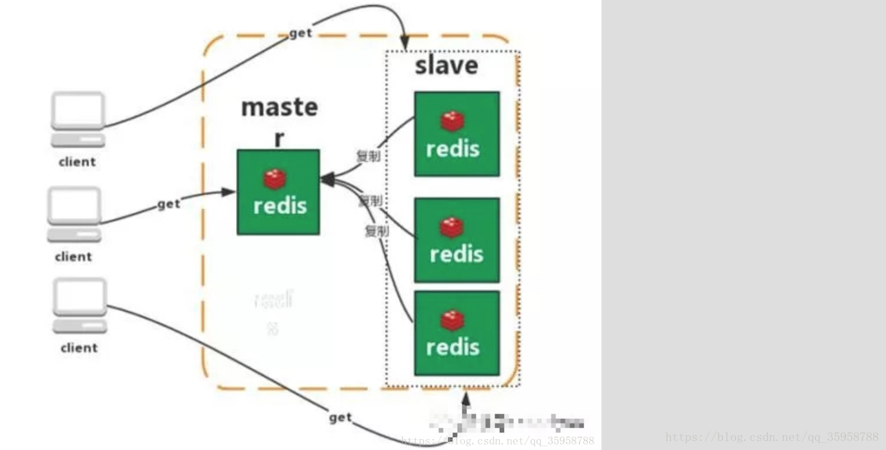

# Redis 学习笔记
 在日常开发过程中，无不都是使用数据库进行操作的存储，由于一般的系统任务中不会存在高并发的情况，当遇到主页访问量增大时，磁盘的读写速度慢而存在严重的弊端。  
 NoSql技术就是克服以上问题而引入的，这是一种基于内存的数据库，并且提供一定的持久化功能。  
 Redis和MongoDB是当前使用的最广泛的NoSql技术，而就Redis而言，它的性能十分优越，可以支持十几万次的读写操纵，还支持集群，分布式，主从同步等配置。
 ## Redis应用场景--数据类型
 ### string类型
 作为常规的key-value缓存应用，主要是用于计数使用，例如微博数，粉丝数等  
 **注：一个键的最大值是512mb**
 ### hash类型
 redis hash是一个string类型的field和value的映射表，hash特别适用于存储对象（因为对象可以包含多种属性）  
 常用命令:hget hset hgetall  
 **主要用来存储对象信息**  
 ### list类型
 list只是简单字符串列表，按照插入的顺序进行排序（由LinkedList内部实现），可以选择将一个链表插入到头部或者尾部  
 常用命令 :lpush（添加左边元素）,rpush,lpop（移除左边第一个元素）,rpop,lrange（获取列表片段，LRANGE key start stop）等  
 应用场景：Redis list的应用场景非常多，也是Redis最重要的数据结构之一，比如twitter的关注列表，粉丝列表等都可以用Redis的list结构来实现
 ### set类型
 对外提供的是与list相同的一个列表功能，特殊之处在于set可以自动去重，set提供了判断某个元素是否在set集合内，可以基于set轻易实现交集，并集，差集等操作  
 应用场景：在微博中，可以将一个用户所有的关注人存在一个集合中，将其所有粉丝存在一个set集合，可以非常方便的实现如共同关注、共同喜好、二度好友等功能，对上面的所有集合操作，你还可以使用不同的命令选择将结果返回给客户端还是存集到一个新的集合中
 ### zset类型（sorted set）
 Redis sorted set的内部使用HashMap和跳跃表(SkipList)来保证数据的存储和有序。zset相对于set增加了一个score的权重参数，HashMap里放的是成员到score的映射，跳跃表按score从小到大保存所有集合元素。使用跳跃表的结构可以获得比较高的查找效率，并且在实现上比较简单。时间复杂度与红黑树相同O(logn)，增加、删除的操作较为简单  
 应用场景：排行榜
 ## Redis删除机制
 Redis在set key的时候，可以额外给一个expire的参数，这是设置过期时间的
 ### 定期删除
 Redis每隔100ms就会随机抽取一些设置了过期时间的key，检查其是否过期，如果过期就将其删除。  
 随机检查过期删除的原因在于，每隔100ms就检查所有的key，会造成巨大的资源消耗
 ### 惰性删除
 定期删除可能会造成某些已经过期的key未被删除，那么当用户请求某个key的时候，Redis会检查此时key是否已经过期，如果已经过期则会删除
 ## 内存淘汰机制
 - volatile-lru:从已被设置了过期的数据集中挑选最近最少使用的进行淘汰
 - volatile-ttl:从已被设置了过期的数据集中选取即将要过期的进行随机淘汰
 - volatile-random:从已被设置了过期的数据集中随机选取数据进行淘汰
 - allkeys-lru:当内存空间不足以容纳新的数据时，从已存在的数据集中选取最少使用的数据进行淘汰
 - allkeys-random：当内存空间不足以容纳新的数据时，从已存在的数据集中随机选取数据进行淘汰
 - no-evicion:禁止驱逐，内存空间不足时报错
 ## Redis持久化机制
 ###快照持久层（RDB）
 Redis可以通过快照来获得内存中某个数据在某个时间点的副本.Redis创建快照之后，可以对快照进行备份,可以将快照复制到其他服务器从而创建相同数据的服务器副本，还可以将快照留在原地以便重启时使用  
 save 900 1 在900秒内有一个key发生变化，创建快照  
 save 300 10 在300秒内有十个key发生变化，创建快照  
 save 60 10000 在60秒内有10000个key发生变化，创建快照
 ### AOF(append-only file)持久化
 在默认情况下未开启，在config文件中修改appendOnly为yes即可  
 AOF文件中的保存位置和RDB位置相同，每当有一条对数据进行更改的命令，Redis就会将此命令写入AOF文件中，默认名为appendOnly.aof  
 appendSync always 每次有数据更改的时候就将此命令写入AOF文件，但会降低redis的速度  
 appendSync everysec 每秒同步一次，显示将多个命令写入磁盘（推荐）  
 appendSync no 让操作系统决定同步  
 AOF重写：在执行BGREWRITEAOF时，Redis服务器会维护一个AOF重写缓冲区，该缓冲区会在子进程创建AOF文件期间，记录服务器执行的所有写命令。当进程完成创建AOF文件的工作之后，服务器会将重写缓冲区中所有内容追加到AOF文件中，使得新旧AOF文件中保持一致。
 ### RDB和AOF的对比
 - aof文件比rdb更新频率更高，优先使用aof持久化数据
 - aof文件比rdb更安全
 - rdb性能比aof好
 - 两个都配了应选aof
 ## Redis架构模式
 ### 单机版模式
 
 缺点：1、内存容量有限2、处理能力有限3、无法高可用
 ### 主从复制
  
  redis的复制功能允许用户根据一个Redis服务器例创建任意多个该服务的复制品，其中被复制的主服务器，复制出来的是从服务器。 只要主从服务器之间的网络连接正常，主从服务器两者会具有相同的数据，主服务器就会一直将发生在自己身上的数据更新同步 给从服务器，从而一直保证主从服务器的数据相同。  
  优点：降低master读压力在转交给从库
  缺点：1、无法保证高可用2、没有解决master写压力
  ### 哨兵模式
   
   Redis sentinel是一个分布式监控，Redis主从服务器，并在主服务器下线时自动进行故障转移。  
   - 监控：sentinel会不间断的检查主服务器和从服务器是否运行正常
   - 提醒：当被监控的某个redis服务器出现问题时，sentinel可以通过API向管理员或其他应用程序发送通知
   - 自动故障转移：当一个主服务器不能正常工作时，sentinel会自动进行故障转移
   缺点：1、主从模式，却换需要时间可能丢失数据2、没有解决master写的压力
  