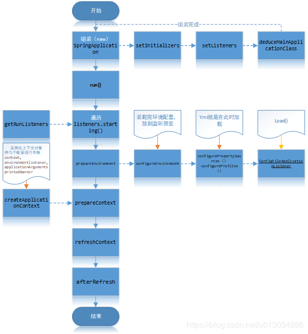

# SpringBoot笔记
　如果要想在 Spring 之中整合 RabbitMQ、Kafka、ActiveMQ、MySQL、 Druid、Redis、Shiro，需要编写一堆堆的*.xml 配置文件； 所以在这样的一个大的历史背景下，很多人开始寻求更加简便的开发，而遗憾的是这种简便的开发没有被 JDK 所支持、没有 被 JavaEE 所支持，因为这些只是平台，平台能够提供的只是最原始的技术支持。这一时刻终于由于 Spring 框架的升级而得到了新 生，SpringBoot 的出现，改变了所有 Java 开发的困境，SpringBoot 的最终奉行的宗旨：废除掉所有复杂的开发，废除掉所有的配置文件，让开发变得更简单纯粹，核心：“零配置”
## SpringBoot特性
* 快速创建项目，简化配置
* 容器内嵌，独立运行，内嵌了tomcat
* 提供约定的starter POM来简化Maven配置
* 基本可以不使用xml配置文件，只需要注解配置
* 自动配置（spring/springmvc/事务）
## SpringBoot配置文件
### 结构
yml文件，树状结构  
注意点：  
1，原有的key，例如spring.jpa.properties.hibernate.dialect，按“.”分割，都变成树状的配置  
2，key后面的冒号，后面一定要跟一个空格  
3，把原有的application.properties删掉。然后一定要执行一下  maven -X clean install  
### 优先级
application.yml先加载，application.properties后加载，所有后者的优先级高于前者的优先级
## 启动过程

## 注解
### SpringBootApplication
典型的SpringBoot的启动类配置在src/main/java的根路径下。其中@SpringbootApplication开启组件扫描以及自动配置，而SpringApplication.run()则启动引导应用程序
#### @SpringBootConfiguration
可以看作**@Configuration**注解，告诉容器这个是个JavaConfig的配置类，它是Spring框架的注解
#### @ComponentScan
组件扫描，类似于**<context:component-scan>**,如果扫描到有@Controller，@Service，@Component注解的类，则将其配置为Bean.  
Spring全自动扫描所有通过注解配置的bean，然后将其注册到IOC容器中，我们可以通过basepackages等属性来指定扫描范围，如果不指定的话，默认从声明@ComponentScan所在类的包中进行扫描，正因为如此，SpringBoot的启动类都默认在src/main/java下
#### @EnableAutoConfiguration
表示开启SpringBoot自动配置功能，SpringBoot会根据应用的依赖，自定义Bean，classpath下有没有这个类来猜测你需要的bean
```
@Target(ElementType.TYPE)
@Retention(RetentionPolicy.RUNTIME)
@Documented
@Inherited
@AutoConfigurationPackage
@Import(AutoConfigurationImportSelector.class)
public @interface EnableAutoConfiguration {
    String ENABLED_OVERRIDE_PROPERTY = "spring.boot.enableautoconfiguration";

    Class<?>[] exclude() default {};

    String[] excludeName() default {};
}
```  
其中最关键的要属[@Import(AutoConfigurationImportSelector.class)]，借助[AutoConfigurationImportSelector],@EnableAutoConfiguration可以帮助SpringBoot应用将所有符合条件的@Configuration配置都加载到当前SpringBoot创建的IOC容器中去  
借助于Spring框架原有的一个工具类：SpringFactoriesLoader的支持，@EnableAutoConfiguration可以智能的自动配置功效才得以生效，在AutoConfigurationImportSelector类中可以看到通过[SpringFactoriesLoader.loadFactoryNames()]把 [spring-boot-autoconfigure.jar/META-INF/spring.factories]中每一个xxxAutoConfiguration文件都加载到容器中  
SpringFactoriesLoader属于Spring框架私有的一种扩展方案,，其主要功能就是从指定的配置文件META-INF/spring-factories加载配置，spring-factories是一个典型的java properties文件，只不过Key和Value都是Java类型的完整类名,在@EnableAutoConfiguration场景中，它更多提供了一种配置查找的功能支持，即根据@EnableAutoConfiguration的完整类名org.springframework.boot.autoconfig.EnableAutoConfiguration作为查找的Key，获得对应的一组@Configuration类。SpringFactoriesLoader是一个抽象类，类中定义的静态属性定义了其加载资源的路径public static final String FACTORIES_RESOURCE_LOCATION = "META-INF/spring.factories"  
### Import
注解用于导入配置类中，假如在一个Configuration中，需要使用另一个Configuration，这个配置类中有一个Bean依赖于另一个Configuration，则需要使用[@Import]引用  
需要注意的是，在4.2之前[@Import]注解只支持导入配置类，但是在4.2之后，它支持导入普通类，将这个类作为Bean定义注册到IOC容器中。
### Conditional
注解表示满足某个条件之后才会初始化一个Bean或者启用某些配置之后，它一般用在@Component，@Service，@Controller，@Configuration等注解标识的类上面或者由@Bean标记的方法上面。如果一个@Configuration类标记了[@Conditional],则其下的所有@Bean方法以及@Import都将遵从这个条件
* @ConditionalOnClass ： classpath中存在该类时起效
* @ConditionalOnMissingClass ： classpath中不存在该类时起效
* @ConditionalOnBean ： DI容器中存在该类型Bean时起效
* @ConditionalOnMissingBean ： DI容器中不存在该类型Bean时起效
* @ConditionalOnSingleCandidate ： DI容器中该类型Bean只有一个或@Primary的只有一个时起效
* @ConditionalOnExpression ： SpEL表达式结果为true时
* @ConditionalOnProperty ： 参数设置或者值一致时起效
* @ConditionalOnResource ： 指定的文件存在时起效
* @ConditionalOnJndi ： 指定的JNDI存在时起效
* @ConditionalOnJava ： 指定的Java版本存在时起效
* @ConditionalOnWebApplication ： Web应用环境下起效
* @ConditionalOnNotWebApplication ： 非Web应用环境下起效
在Spring里面，可以很方便的编写自己的条件类，所要做的就是实现Condition接口并覆盖matches()方法即可
## IOC容器
负责管理对象，包括创建对象，发布对象，销毁对象等生命周期，查询对象的依赖关系，注入依赖对象  
BeanDefinition承担IOC容器管理各个业务对象以及它们之间的依赖关系，需要通过某种途径来记录管理关系。每一个Bean都会有一个对应的BeanDefinition实例，负责保存Bean对象的所有信息。包括bean对象的class类型，是否是抽象类型，构造方法，参数，其他属性等等。当客户端向容器请求相应的对象，容器就会向客户端的客户端返回一个完整可用的Bean实例。  
BeanDefinitionRegistry(Bean定义登记)抽象出Bean的注册逻辑，而BeanFactory抽象生Bean的管理逻辑，各个BeanFactory的实现类就是具体承担Bean的注册以及管理。DefaultListableBeanFactory是一个比较通用的BeanFactory实现，它同时实现BeanDefinitionRegistry以及BeanFactory接口，所以展现了注册和管理的功能  
BeanFactory主要包含了getBean，containBean，getType，getAliase等管理Bean的方法。而BeanDefinitionRegistry则包含了registerBeanDefinition，removeBeanDefinition,getBeanDefinition等注册管理BeanDefinition的方法。
```
 // 默认容器实现
 DefaultListableBeanFactory beanRegistry=new DefaultListableBeanFactory();
 // 根据业务对象构造对应的BeanDefinition
 AbstractBeanDefinition definition=new RootBeanDefinition(Bussiness.class,true);
 // 将Bean定义注册到容器中
 beanRegistry.registerBeanDefinition("beanName",definition);
 /*
 然后可以从容器中获取这个实例
 这里的BeanRegistry其实实现了BeanFactory接口，所以可以强转
 单纯的BeanDefinitionRegistry无法强转，这里的DefaultListableBeanFactory实现了BeanFactory，所以可以强转
 */
  BeanFactory beanFactory=(BeanFactory) beanRegistry;
  Bussiness bussiness=beanFactory.getBean("beanName");
```                                                                                                                                               
## Spring IOC容器实现
### 第一阶段
容器启动时，会通过某种途径加载ConfigurationMetaData，在大部分情况下，容器需要依赖某些工具类，比如BeanDefinitionReader，此时BeanDefinitionReader会对加载的ConfigurationMetaData进行解析，并将分析后的信息组装为相应的BeanDefinition，最后把保存了bean定义的BeanDefinition注册到BeanDefinitionRegistry中
```
// 通常BeanDefinitionRegistry的实现类，这里以DefaultListableBeanFactory为例
DefaultListableBeanFactory beanRegistry=new DefaultListableBeanFactory();
// xmlBeanDefinitionReader 实现了BeanDefinitionRegistry接口
XmlBeanDefinitionReader reader=new xmlBeanDefinitionReader(beanRegistry);
// 加载xml文件
reader.loadBeanDefinitions("classpath:spring-bean.xml");
// 从容器中获取bean实例
BeanFactory beanFactory=（BeanFactory） beanRegistry;
Bussiness bussiness=beanFactory.getBean("beanName");
```
### 第二阶段
经过第一个阶段，所有Bean定义都通过了BeanDefinition的方式注册到了BeanDefinitionRegistry，当某个请求通过容器的getBean方式去请求某个对象，或者因为依赖关系容器需要隐式调用getBean时，就会触发第二阶段。  
容器首先会检查所请求的对象是否实例化完成，如果没有，则会根据注册的BeanDefinition实例化对象，并为其注入依赖，当该对象装配完毕后，将此对象返回给请求者。  
BeanFactory只是Spring IOC容器的一种实现，如果没有特殊指定，它将采用延迟初始化策略：只有当访问容器中的一个对象，才对该对象进行初始化和依赖注入操作，而在实际操作中，使用的是另一种类型的场景：ApplicationContext，它构建在BeanFactory上，属于更高级的容器，除了具有BeanFactory的所有能力之外，还提供了事件监听制以及国际化支持。它管理的Bean，在容器启动时全部完成初始化和依赖注入的操作
