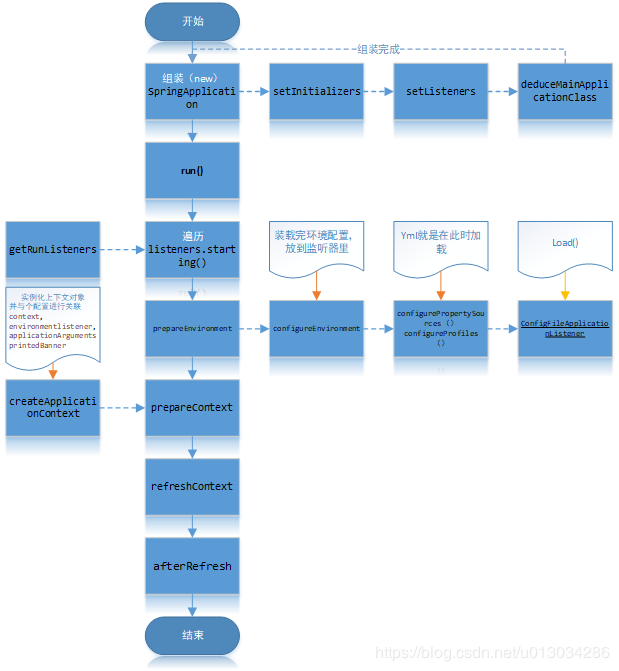
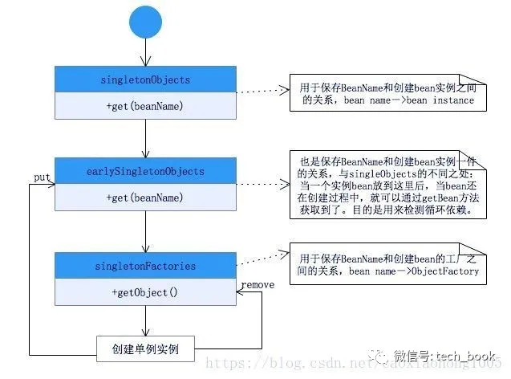

# SpringBoot笔记
　如果要想在 Spring 之中整合 RabbitMQ、Kafka、ActiveMQ、MySQL、 Druid、Redis、Shiro，需要编写一堆堆的*.xml 配置文件； 所以在这样的一个大的历史背景下，很多人开始寻求更加简便的开发，而遗憾的是这种简便的开发没有被 JDK 所支持、没有 被 JavaEE 所支持，因为这些只是平台，平台能够提供的只是最原始的技术支持。这一时刻终于由于 Spring 框架的升级而得到了新 生，SpringBoot 的出现，改变了所有 Java 开发的困境，SpringBoot 的最终奉行的宗旨：废除掉所有复杂的开发，废除掉所有的配置文件，让开发变得更简单纯粹，核心："零配置"
## SpringBoot特性
* 快速创建项目，简化配置
* 容器内嵌，独立运行，内嵌了tomcat
* 提供约定的starter POM来简化Maven配置
* 基本可以不使用xml配置文件，只需要注解配置
* 自动配置（spring/springmvc/事务）
## SpringBoot配置文件
### 结构
yml文件，树状结构  
注意点：  
1，原有的key，例如spring.jpa.properties.hibernate.dialect，按"."分割，都变成树状的配置  
2，key后面的冒号，后面一定要跟一个空格  
3，把原有的application.properties删掉。然后一定要执行一下  maven -X clean install  
### 优先级
application.yml先加载，application.properties后加载，所有后者的优先级高于前者的优先级
## 启动过程

## 注解
### SpringBootApplication
典型的SpringBoot的启动类配置在src/main/java的根路径下。其中@SpringbootApplication开启组件扫描以及自动配置，而SpringApplication.run()则启动引导应用程序
#### @SpringBootConfiguration
可以看作**@Configuration**注解，告诉容器这个是个JavaConfig的配置类，它是Spring框架的注解
#### @ComponentScan
组件扫描，类似于**<context:component-scan>**,如果扫描到有@Controller，@Service，@Component注解的类，则将其配置为Bean.  
Spring全自动扫描所有通过注解配置的bean，然后将其注册到IOC容器中，我们可以通过basepackages等属性来指定扫描范围，如果不指定的话，默认从声明@ComponentScan所在类的包中进行扫描，正因为如此，SpringBoot的启动类都默认在src/main/java下
#### @EnableAutoConfiguration
表示开启SpringBoot自动配置功能，SpringBoot会根据应用的依赖，自定义Bean，classpath下有没有这个类来猜测你需要的bean
```
@Target(ElementType.TYPE)
@Retention(RetentionPolicy.RUNTIME)
@Documented
@Inherited
@AutoConfigurationPackage
@Import(AutoConfigurationImportSelector.class)
public @interface EnableAutoConfiguration {
    String ENABLED_OVERRIDE_PROPERTY = "spring.boot.enableautoconfiguration";

    Class<?>[] exclude() default {};

    String[] excludeName() default {};
}
```  
其中最关键的要属[@Import(AutoConfigurationImportSelector.class)]，借助[AutoConfigurationImportSelector],@EnableAutoConfiguration可以帮助SpringBoot应用将所有符合条件的@Configuration配置都加载到当前SpringBoot创建的IOC容器中去  
借助于Spring框架原有的一个工具类：SpringFactoriesLoader的支持，@EnableAutoConfiguration可以智能的自动配置功效才得以生效，在AutoConfigurationImportSelector类中可以看到通过[SpringFactoriesLoader.loadFactoryNames()]把 [spring-boot-autoconfigure.jar/META-INF/spring.factories]中每一个xxxAutoConfiguration文件都加载到容器中  
SpringFactoriesLoader属于Spring框架私有的一种扩展方案,，其主要功能就是从指定的配置文件META-INF/spring-factories加载配置，spring-factories是一个典型的java properties文件，只不过Key和Value都是Java类型的完整类名,在@EnableAutoConfiguration场景中，它更多提供了一种配置查找的功能支持，即根据@EnableAutoConfiguration的完整类名org.springframework.boot.autoconfig.EnableAutoConfiguration作为查找的Key，获得对应的一组@Configuration类。SpringFactoriesLoader是一个抽象类，类中定义的静态属性定义了其加载资源的路径public static final String FACTORIES_RESOURCE_LOCATION = "META-INF/spring.factories"  
### Import
注解用于导入配置类中，假如在一个Configuration中，需要使用另一个Configuration，这个配置类中有一个Bean依赖于另一个Configuration，则需要使用[@Import]引用  
需要注意的是，在4.2之前[@Import]注解只支持导入配置类，但是在4.2之后，它支持导入普通类，将这个类作为Bean定义注册到IOC容器中。
### Conditional
注解表示满足某个条件之后才会初始化一个Bean或者启用某些配置之后，它一般用在@Component，@Service，@Controller，@Configuration等注解标识的类上面或者由@Bean标记的方法上面。如果一个@Configuration类标记了[@Conditional],则其下的所有@Bean方法以及@Import都将遵从这个条件
* @ConditionalOnClass ： classpath中存在该类时起效
* @ConditionalOnMissingClass ： classpath中不存在该类时起效
* @ConditionalOnBean ： DI容器中存在该类型Bean时起效
* @ConditionalOnMissingBean ： DI容器中不存在该类型Bean时起效
* @ConditionalOnSingleCandidate ： DI容器中该类型Bean只有一个或@Primary的只有一个时起效
* @ConditionalOnExpression ： SpEL表达式结果为true时
* @ConditionalOnProperty ： 参数设置或者值一致时起效
* @ConditionalOnResource ： 指定的文件存在时起效
* @ConditionalOnJndi ： 指定的JNDI存在时起效
* @ConditionalOnJava ： 指定的Java版本存在时起效
* @ConditionalOnWebApplication ： Web应用环境下起效
* @ConditionalOnNotWebApplication ： 非Web应用环境下起效
在Spring里面，可以很方便的编写自己的条件类，所要做的就是实现Condition接口并覆盖matches()方法即可
## IOC容器
负责管理对象，包括创建对象，发布对象，销毁对象等生命周期，查询对象的依赖关系，注入依赖对象  
BeanDefinition承担IOC容器管理各个业务对象以及它们之间的依赖关系，需要通过某种途径来记录管理关系。每一个Bean都会有一个对应的BeanDefinition实例，负责保存Bean对象的所有信息。包括bean对象的class类型，是否是抽象类型，构造方法，参数，其他属性等等。当客户端向容器请求相应的对象，容器就会向客户端的客户端返回一个完整可用的Bean实例。  
BeanDefinitionRegistry(Bean定义登记)抽象出Bean的注册逻辑，而BeanFactory抽象生Bean的管理逻辑，各个BeanFactory的实现类就是具体承担Bean的注册以及管理。DefaultListableBeanFactory是一个比较通用的BeanFactory实现，它同时实现BeanDefinitionRegistry以及BeanFactory接口，所以展现了注册和管理的功能  
BeanFactory主要包含了getBean，containBean，getType，getAliase等管理Bean的方法。而BeanDefinitionRegistry则包含了registerBeanDefinition，removeBeanDefinition,getBeanDefinition等注册管理BeanDefinition的方法。
```
 // 默认容器实现
 DefaultListableBeanFactory beanRegistry=new DefaultListableBeanFactory();
 // 根据业务对象构造对应的BeanDefinition
 AbstractBeanDefinition definition=new RootBeanDefinition(Bussiness.class,true);
 // 将Bean定义注册到容器中
 beanRegistry.registerBeanDefinition("beanName",definition);
 /*
 然后可以从容器中获取这个实例
 这里的BeanRegistry其实实现了BeanFactory接口，所以可以强转
 单纯的BeanDefinitionRegistry无法强转，这里的DefaultListableBeanFactory实现了BeanFactory，所以可以强转
 */
  BeanFactory beanFactory=(BeanFactory) beanRegistry;
  Bussiness bussiness=beanFactory.getBean("beanName");
```                                                                                                                                               
## Spring IOC容器实现
### 第一阶段
容器启动时，会通过某种途径加载ConfigurationMetaData，在大部分情况下，容器需要依赖某些工具类，比如BeanDefinitionReader，此时BeanDefinitionReader会对加载的ConfigurationMetaData进行解析，并将分析后的信息组装为相应的BeanDefinition，最后把保存了bean定义的BeanDefinition注册到BeanDefinitionRegistry中
```
// 通常BeanDefinitionRegistry的实现类，这里以DefaultListableBeanFactory为例
DefaultListableBeanFactory beanRegistry=new DefaultListableBeanFactory();
// xmlBeanDefinitionReader 实现了BeanDefinitionRegistry接口
XmlBeanDefinitionReader reader=new xmlBeanDefinitionReader(beanRegistry);
// 加载xml文件
reader.loadBeanDefinitions("classpath:spring-bean.xml");
// 从容器中获取bean实例
BeanFactory beanFactory=（BeanFactory） beanRegistry;
Bussiness bussiness=beanFactory.getBean("beanName");
```
### 第二阶段
经过第一个阶段，所有Bean定义都通过了BeanDefinition的方式注册到了BeanDefinitionRegistry，当某个请求通过容器的getBean方式去请求某个对象，或者因为依赖关系容器需要隐式调用getBean时，就会触发第二阶段。  
容器首先会检查所请求的对象是否实例化完成，如果没有，则会根据注册的BeanDefinition实例化对象，并为其注入依赖，当该对象装配完毕后，将此对象返回给请求者。  
BeanFactory只是Spring IOC容器的一种实现，如果没有特殊指定，它将采用延迟初始化策略：只有当访问容器中的一个对象，才对该对象进行初始化和依赖注入操作，而在实际操作中，使用的是另一种类型的场景：ApplicationContext，它构建在BeanFactory上，属于更高级的容器，除了具有BeanFactory的所有能力之外，还提供了事件监听制以及国际化支持。它管理的Bean，在容器启动时全部完成初始化和依赖注入的操作
## Spring Boot读取配置方式
在application.yml或者properties文件中添加：
```
info.address=USA
info.company=Spring
info.degree=high
```
### @Value注解读取方式
```
import org.springframework.beans.factory.annotation.Value;
import org.springframework.stereotype.Component;
 
@Component
public class InfoConfig1 {
 
   @Value("${info.address}")
   private String address;
 
   @Value("${info.company}")
   private String company;
 
   @Value("${info.degree}")
   private String degree;
 
   public String getAddress() {
       return address;
   }
 
   public void setAddress(String address) {
       this.address = address;
   }
 
   public String getCompany() {
       return company;
   }
 
   public void setCompany(String company) {
       this.company = company;
   }
 
   public String getDegree() {
       return degree;
   }
 
   public void setDegree(String degree) {
       this.degree = degree;
   }
 
}
```
### @ConfigurationProperties注解读取方式
```
@Component
@ConfigurationProperties(prefix = "info")
public class InfoConfig2 {
 
   private String address;
   private String company;
   private String degree;
 
   public String getAddress() {
       return address;
   }
 
   public void setAddress(String address) {
       this.address = address;
   }
 
   public String getCompany() {
       return company;
   }
 
   public void setCompany(String company) {
       this.company = company;
   }
 
   public String getDegree() {
       return degree;
   }
 
   public void setDegree(String degree) {
       this.degree = degree;
   }
 
}
```
### 读取指定文件
资源目录下建立config/db-config.properties:
```
db.username=root
db.password=123456
```
#### @PropertySource+@Value注解读取方式
```
@Component
@PropertySource(value = { "config/db-config.properties" })
public class DBConfig1 {
 
   @Value("${db.username}")
   private String username;
 
   @Value("${db.password}")
   private String password;
 
   public String getUsername() {
       return username;
   }
 
   public void setUsername(String username) {
       this.username = username;
   }
 
   public String getPassword() {
       return password;
   }
 
   public void setPassword(String password) {
       this.password = password;
   }
 
}
```
注意：@PropertySource不支持yml文件读取
#### @PropertySource+@ConfigurationProperties注解读取方式
```
@Component
@ConfigurationProperties(prefix = "db")
@PropertySource(value = { "config/db-config.properties" })
public class DBConfig2 {
 
   private String username;
   private String password;
 
   public String getUsername() {
       return username;
   }
 
   public void setUsername(String username) {
       this.username = username;
   }
 
   public String getPassword() {
       return password;
   }
 
   public void setPassword(String password) {
       this.password = password;
   }
 
}
```
## SpringBoot的九种设计模式
### 简单工厂(非23中设计模式)
#### 实现方式
BeanFactory。Spring中的BeanFactory就是简单工厂模式的体现，根据传入一个唯一的标识来获得Bean对象，但是否是在传入参数后创建还是传入参数前创建这个要根据具体情况来定  
#### 实质
由一个工厂类根据传入的参数，动态决定应该创建哪一个产品类  
#### 实现原理
**bean容器的启动阶段：**  
     
    1.读取bean的xml配置文件,将bean元素分别转换成一个BeanDefinition对象。

    2.然后通过BeanDefinitionRegistry将这些bean注册到beanFactory中，保存在它的一个ConcurrentHashMap中。

    3.将BeanDefinition注册到了beanFactory之后，在这里Spring为我们提供了一个扩展的切口，允许我们通过实现接口BeanFactoryPostProcessor 在此处来插入我们定义的代码。  
典型的例子就是：PropertyPlaceholderConfigurer，我们一般在配置数据库的dataSource时使用到的占位符的值，就是它注入进去的  
**容器中bean的实例化阶段：**  
实例化阶段主要是通过反射或者CGLIB对bean进行实例化，在这个阶段Spring又给我们暴露了很多的扩展点  

    1.各种的Aware接口 ，比如 BeanFactoryAware，对于实现了这些Aware接口的bean，在实例化bean时Spring会帮我们注入对应的BeanFactory的实例。

    2.BeanPostProcessor接口 ，实现了BeanPostProcessor接口的bean，在实例化bean时Spring会帮我们调用接口中的方法。

    3.InitializingBean接口 ，实现了InitializingBean接口的bean，在实例化bean时Spring会帮我们调用接口中的方法。

    4.DisposableBean接口 ，实现了BeanPostProcessor接口的bean，在该bean死亡时Spring会帮我们调用接口中的方法。
#### 设计意义
**松耦合** 可以将原来硬编码的依赖，通过Spring这个beanFactory这个工厂来注入依赖，也就是说原来只有依赖方和被依赖方，现在我们引入了第三方——spring这个beanFactory，由它来解决bean之间的依赖问题，达到了松耦合的效果  
**bean的额外处理** 通过Spring接口的暴露，在实例化bean的阶段我们可以进行一些额外的处理，这些额外的处理只需要让bean实现对应的接口即可，那么spring就会在bean的生命周期调用我们实现的接口来处理该bean  
### 工厂方法
#### 实现方式
FactoryBean接口
#### 实现原理
实现了FactoryBean接口的bean是一类叫做factory的bean。其特点是，spring会在使用getBean()调用获得该bean时，会自动调用该bean的getObject()方法，所以返回的不是factory这个bean，而是这个bean.getOjbect()方法的返回值  
实现FactoryBean接口,需要实现其getObject()方法  
### 单例模式
Spring依赖注入Bean实例默认是单例的  
Spring的依赖注入（包括lazy-init方式）都是发生在**AbstractBeanFactory**的**getBean**里。**getBean**的**doGetBean**方法调用**getSingleton**进行bean的创建  
```
public Object getSingleton(String beanName){
    //参数true设置标识允许早期依赖
    return getSingleton(beanName,true);
}
protected Object getSingleton(String beanName, boolean allowEarlyReference) {
    //检查缓存中是否存在实例
    Object singletonObject = this.singletonObjects.get(beanName);
    if (singletonObject == null && isSingletonCurrentlyInCreation(beanName)) {
        //如果为空，则锁定全局变量并进行处理。
        synchronized (this.singletonObjects) {
            //如果此bean正在加载，则不处理
            singletonObject = this.earlySingletonObjects.get(beanName);
            if (singletonObject == null && allowEarlyReference) {
                //当某些方法需要提前初始化的时候则会调用addSingleFactory 方法将对应的ObjectFactory初始化策略存储在singletonFactories
                ObjectFactory<?> singletonFactory = this.singletonFactories.get(beanName);
                if (singletonFactory != null) {
                    //调用预先设定的getObject方法
                    singletonObject = singletonFactory.getObject();
                    //记录在缓存中，earlysingletonObjects和singletonFactories互斥
                    this.earlySingletonObjects.put(beanName, singletonObject);
                    this.singletonFactories.remove(beanName);
                }
            }
        }
    }
    return (singletonObject != NULL_OBJECT ? singletonObject : null);
}
```
**getSingleton()过程图**  
spring依赖注入时，使用了 **双重判断加锁** 的单例模式  
  
### 适配器模式
#### 实现方式
SpringMVC中的适配器HandlerAdatper
#### 实现原理
HandlerAdatper根据Handler规则执行不同的Handler
#### 实现过程
DispatcherServlet根据HandlerMapping返回的handler，向HandlerAdatper发起请求，处理Handler  
HandlerAdapter根据规则找到对应的Handler并让其执行，执行完毕后Handler会向HandlerAdapter返回一个ModelAndView，最后由HandlerAdapter向DispatchServelet返回一个ModelAndView  
#### 实现意义
HandlerAdatper使得Handler的扩展变得容易，只需要增加一个新的Handler和一个对应的HandlerAdapter即可  
因此Spring定义了一个适配接口，使得每一种Controller有一种对应的适配器实现类，让适配器代替controller执行相应的方法。这样在扩展Controller时，只需要增加一个适配器类就完成了SpringMVC的扩展了  
### 装饰器模式
#### 实现方式
Spring中用到的包装器模式在类名上有两种表现：一种是类名中含有Wrapper，另一种是类名中含有Decorator  
#### 实质
动态地给一个对象添加一些额外的职责。就增加功能来说，Decorator模式相比生成子类更为灵活  
### 代理模式
#### 实现方式
AOP底层，就是动态代理模式的实现  
#### 实现原理
切面在应用运行的时刻被织入。一般情况下，在织入切面时，AOP容器会为目标对象创建动态的创建一个代理对象。SpringAOP就是以这种方式织入切面的  
织入：把切面应用到目标对象并创建新的代理对象的过程
### 观察者模式
#### 实现方式
spring的事件驱动模型使用的是 观察者模式 ，Spring中Observer模式常用的地方是listener的实现  
#### 具体实现
事件机制的实现需要三个部分,**事件源**,**事件**,**事件监听器**  
ApplicationEvent抽象类[事件]  
继承自jdk的EventObject,所有的事件都需要继承ApplicationEvent,并且通过构造器参数source得到事件源  
```java
public abstract class ApplicationEvent extends EventObject {
    private static final long serialVersionUID = 7099057708183571937L;
    private final long timestamp;
    public ApplicationEvent(Object source) {
    super(source);
    this.timestamp = System.currentTimeMillis();
    }
    public final long getTimestamp() {
        return this.timestamp;
    }
}
```
ApplicationListener接口[事件监听器]  
继承自jdk的EventListener,所有的监听器都要实现这个接口  
这个接口只有一个onApplicationEvent()方法,该方法接受一个ApplicationEvent或其子类对象作为参数,在方法体中,可以通过不同对Event类的判断来进行相应的处理  
当事件触发时所有的监听器都会收到消息  
```java
public interface ApplicationListener<E extends ApplicationEvent> extends EventListener {
     void onApplicationEvent(E event);
}
```
ApplicationContext接口[事件源],ApplicationContext是spring中的全局容器，翻译过来是”应用上下文”。实现了ApplicationEventPublisher接口  
#### 职责
负责读取bean的配置文档,管理bean的加载,维护bean之间的依赖关系,可以说是负责bean的整个生命周期,再通俗一点就是我们平时所说的IOC容器  
```java
public interface ApplicationEventPublisher {
        void publishEvent(ApplicationEvent event);
}

public void publishEvent(ApplicationEvent event) {
    Assert.notNull(event, "Event must not be null");
    if (logger.isTraceEnabled()) {
         logger.trace("Publishing event in " + getDisplayName() + ": " + event);
    }
    getApplicationEventMulticaster().multicastEvent(event);
    if (this.parent != null) {
    this.parent.publishEvent(event);
    }
}
```
ApplicationEventMulticaster抽象类[事件源中publishEvent方法需要调用其方法getApplicationEventMulticaster],属于事件广播器,它的作用是把ApplicationContext发布的Event广播给所有的监听器  
```java
public abstract class AbstractApplicationContext extends DefaultResourceLoader
    implements ConfigurableApplicationContext, DisposableBean {
    private ApplicationEventMulticaster applicationEventMulticaster;
    protected void registerListeners() {
    // Register statically specified listeners first.
    for (ApplicationListener<?> listener : getApplicationListeners()) {
    getApplicationEventMulticaster().addApplicationListener(listener);
    }
    // Do not initialize FactoryBeans here: We need to leave all regular beans
    // uninitialized to let post-processors apply to them!
    String[] listenerBeanNames = getBeanNamesForType(ApplicationListener.class, true, false);
    for (String lisName : listenerBeanNames) {
    getApplicationEventMulticaster().addApplicationListenerBean(lisName);
    }
  }
}
```
### 策略模式
#### 实现方式
Spring框架的资源访问Resource接口。该接口提供了更强的资源访问能力，Spring 框架本身大量使用了 Resource 接口来访问底层资源  
#### Resource 接口介绍
source 接口是具体资源访问策略的抽象，也是所有资源访问类所实现的接口  
**Resource 接口主要提供了如下几个方法:**  

       1.getInputStream()： 定位并打开资源，返回资源对应的输入流。每次调用都返回新的输入流。调用者必须负责关闭输入流。

       2.exists()： 返回 Resource 所指向的资源是否存在。

       3.isOpen()： 返回资源文件是否打开，如果资源文件不能多次读取，每次读取结束应该显式关闭，以防止资源泄漏。

       4.getDescription()： 返回资源的描述信息，通常用于资源处理出错时输出该信息，通常是全限定文件名或实际 URL。

       5.getFile： 返回资源对应的 File 对象。

       6.getURL： 返回资源对应的 URL 对象
 最后两个方法通常无须使用，仅在通过简单方式访问无法实现时，Resource 提供传统的资源访问的功能  
 Resource 接口本身没有提供访问任何底层资源的实现逻辑，针对不同的底层资源，Spring 将会提供不同的 Resource 实现类，不同的实现类负责不同的资源访问逻辑  
**Spring 为 Resource 接口提供了如下实现类：**  
    
    UrlResource： 访问网络资源的实现类。
    
    ClassPathResource： 访问类加载路径里资源的实现类。
    
    FileSystemResource： 访问文件系统里资源的实现类。
    
    ServletContextResource： 访问相对于 ServletContext 路径里的资源的实现类.
    
    InputStreamResource： 访问输入流资源的实现类。
    
    ByteArrayResource： 访问字节数组资源的实现类。
### 模板方法模式
#### 经典模板方法定义
父类定义了骨架（调用哪些方法及顺序），某些特定方法由子类实现  
最大的好处：代码复用，减少重复代码。除了子类要实现的特定方法，其他方法及方法调用顺序都在父类中预先写好了  
**所以父类模板方法中有两类方法：**  
**共同的方法：** 所有子类都会用到的代码  
**不同的方法：** 子类要覆盖的方法，分为两种  
   
     抽象方法：父类中的是抽象方法，子类必须覆盖
   
     钩子方法：父类中是一个空方法，子类继承了默认也是空的
**注：** 为什么叫钩子，子类可以通过这个钩子（方法），控制父类，因为这个钩子实际是父类的方法（空方法）！
#### Spring模板方法模式实质
是模板方法模式和回调模式的结合，是Template Method不需要继承的另一种实现方式。Spring几乎所有的外接扩展都采用这种模式  
##### 具体实现
JDBC的抽象和对Hibernate的集成，都采用了一种理念或者处理方式，那就是模板方法模式与相应的Callback接口相结合  
采用模板方法模式是为了以一种统一而集中的方式来处理资源的获取和释放，以JdbcTempalte为例:  
```java
public abstract class JdbcTemplate {
     public final Object execute(String sql){
        Connection con=null;
        Statement stmt=null;
        try{
            con=getConnection();
            stmt=con.createStatement();
            Object retValue=executeWithStatement(stmt,sql);
            return retValue;
        }catch(SQLException e){
             
        }finally{
            closeStatement(stmt);
            releaseConnection(con);
        }
    }
    protected abstract Object executeWithStatement（Statement   stmt, String sql）;
}
```
**引入回调原因：**  
JdbcTemplate是抽象类，不能够独立使用，我们每次进行数据访问的时候都要给出一个相应的子类实现,这样肯定不方便，所以就引入了回调  
```java
public interface StatementCallback{
    Object doWithStatement(Statement stmt);
}
```   
利用回调方法重写JdbcTemplate方法  
```java
public class JdbcTemplate {
    public final Object execute(StatementCallback callback){
        Connection con=null;
        Statement stmt=null;
        try{
            con=getConnection();
            stmt=con.createStatement();
            Object retValue=callback.doWithStatement(stmt);
            return retValue;
        }catch(SQLException e){
            
        }finally{
            closeStatement(stmt);
            releaseConnection(con);
        }
    }

    //其它方法定义
}
```
**Jdbc使用方法如下：**  
```
JdbcTemplate jdbcTemplate=...;
    final String sql=...;
    StatementCallback callback=new StatementCallback(){
    public Object=doWithStatement(Statement stmt){
        return ...;
    }
}
jdbcTemplate.execute(callback);
```
##### 为什么JdbcTemplate没有使用继承？
因为这个类的方法太多，但是我们还是想用到JdbcTemplate已有的稳定的、公用的数据库连接，那么我们怎么办呢？  
我们可以把变化的东西抽出来作为一个参数传入JdbcTemplate的方法中。但是变化的东西是一段代码，而且这段代码会用到JdbcTemplate中的变量。怎么办？  
那我们就用回调对象吧。在这个回调对象中定义一个操纵JdbcTemplate中变量的方法，我们去实现这个方法，就把变化的东西集中到这里了。然后我们再传入这个回调对象到JdbcTemplate，从而完成了调用  
