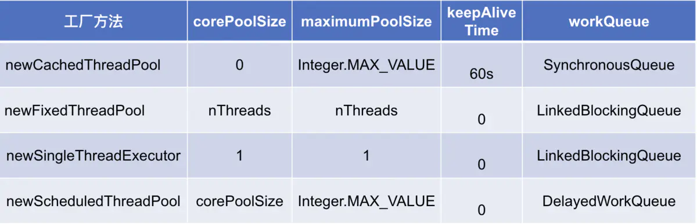

# 多线程笔记
## 基本概念
### 并行
多个cpu实例或者多台机器同时执行一段处理逻辑，是真正的同时
### 并发
通过cpu调度算法，让用户看上去同时执行，实际上从cpu操作层面并不是真正的同时。并发往往在场景中有公用的资源，那么针对这个公用的资源往往产生瓶颈
### 线程安全
经常用来描述一段代码，指在并发的情况下，该代码经过多线程使用，线程的调度顺序不影响执行结果，这个时候使用多线程，我们只需要关注系统的内存，cpu是不是够用即可，反过来线程的调度顺序会影响最终结果
### 同步
Java中的同步指的是通过人为的控制和调度，保证共享资源的多线程访问成为线程安全，线程安全的优先级高于性能
### Runnable和Thread的区别
第二种方法实现了Runnable接口避免了单线程的局限性，所以较为常用，实现Runnable接口接口的方式，更加符合面向对象。线程分为两个部分，一部分为线程对象，一部分为线程任务。Runnable接口对线程对象和线程任务进行解耦。
### 多线程流程概念
    1、新建：线程对象被创建时进入新建状态，Thread thread=new Thread();  

    2、就绪：可执行状态，线程被创建之后，其他线程调用了该对象的start()方法，处于就绪状态随时可能被cpu调度执行  
    
    3、运行：线程获取cpu权限进行执行，需要注意的是线程只能从就绪状态转换为运行状态  

    4、阻塞：阻塞状态表示某种原因放弃cpu使用权限，暂时停止运行，直到线程进入就绪状态
      （1）等待阻塞：通过调用线程wait()方法，让线程等待某工作完成  
      
      （2）同步阻塞：线程在获取synchronized同步锁失败，它会进入同步阻塞状态  
      
      （3）其他阻塞：通过调用sleep()方法，和join()方法或者发送了I/O请求，线程会进入阻塞状态。当sleep()状态，join()状态等线程终止或超时，或者I/0处理完毕，线程重新进入就绪状态  
### sleep\wait\yield\join区别
## 线程池
### 线程池优势
    1、降低系统资源消耗，通过重用已存在的线程，降低线程创建和销毁造成的消耗；
    
    2、提高系统响应速度，当有任务到达时，通过复用已存在的线程，无需等待新线程的创建便能立即执行；
    
    3、方便线程并发数的管控。因为线程若是无限制的创建，可能会导致内存占用过多而产生OOM，并且会造成cpu过度切换（cpu切换线程是有时间成本的（需要保持当前执行线程的现场，并恢复要执行线程的现场））。

    4、提供更强大的功能，延时定时线程池
### 线程池主要参数
```java
public class Test{
public ThreadPoolExecutor(int corePoolSize, int maximumPoolSize, long keepAliveTime, TimeUnit unit, BlockingQueue<Runnable> workQueue, ThreadFactory threadFactory, RejectedExecutionHandler handler) {
    if (corePoolSize < 0 ||
        maximumPoolSize <= 0 ||
        maximumPoolSize < corePoolSize ||
        keepAliveTime < 0)
        throw new IllegalArgumentException();
    if (workQueue == null || threadFactory == null || handler == null)
        throw new NullPointerException();
    this.corePoolSize = corePoolSize;
    this.maximumPoolSize = maximumPoolSize;
    this.workQueue = workQueue;
    this.keepAliveTime = unit.toNanos(keepAliveTime);
    this.threadFactory = threadFactory;
    this.handler = handler;
 }
}
```
**corePoolSize（线程池基本大小）**  
当向线程池提交一个任务时，若线程池已创建的线程数小于corePoolSize，即便此时存在空闲线程，也会通过创建一个新线程来执行该任务，直到已创建的线程数大于或等于corePoolSize时，才会根据是否存在空闲线程，来决定是否需要创建新的线程。除了利用提交新任务来创建和启动线程（按需构造），也可以通过 prestartCoreThread() 或 prestartAllCoreThreads() 方法来提前启动线程池中的基本线程  
**maximumPoolSize（线程池最大大小）**  
线程池所允许的最大线程个数。当队列满了，且已创建的线程数小于maximumPoolSize，则线程池会创建新的线程来执行任务。另外，对于无界队列，可忽略该参数  
**keepAliveTime（线程存活保持时间）**  
默认情况下，当线程池的线程个数多于corePoolSize时，线程的空闲时间超过keepAliveTime则会终止。但只要keepAliveTime大于0，allowCoreThreadTimeOut(boolean) 方法也可将此超时策略应用于核心线程。另外，也可以使用setKeepAliveTime()动态地更改参数  
**workQueue（任务队列）**  
用于传输和保存等待执行任务的阻塞队列  
     
    1、如果运行的线程数少于 corePoolSize，则 Executor 始终首选添加新的线程，而不进行排队。
    
    2、如果运行的线程数等于或多于 corePoolSize，则 Executor 始终首选将请求加入队列，而不添加新的线程。

    3、如果无法将请求加入队列，则创建新的线程，除非创建此线程超出 maximumPoolSize，在这种情况下，任务将被拒绝
**threadFactory（线程工厂）**  
用于创建新线程。threadFactory创建的线程也是采用new Thread()方式，threadFactory创建的线程名都具有统一的风格：pool-m-thread-n（m为线程池的编号，n为线程池内的线程编号）  
**handler（线程饱和策略）**  
当线程池和队列都满了，再加入线程会执行此策略  
 
    1、ThreadPoolExecutor.AbortPolicy：处理程序遭到拒绝，则直接抛出运行时异常 RejectedExecutionException。(默认策略)
    
    2、ThreadPoolExecutor.CallerRunsPolicy：调用者所在线程来运行该任务，此策略提供简单的反馈控制机制，能够减缓新任务的提交速度。
    
    3、ThreadPoolExecutor.DiscardPolicy：无法执行的任务将被删除。
    
    4、ThreadPoolExecutor.DiscardOldestPolicy：如果执行程序尚未关闭，则位于工作队列头部的任务将被删除，然后重新尝试执行任务（如果再次失败，则重复此过程）
**排队有三种通用策略：**  
    
    1、直接提交。工作队列的默认选项是 SynchronousQueue，它将任务直接提交给线程而不保持它们。在此，如果不存在可用于立即运行任务的线程，则试图把任务加入队列将失败，因此会构造一个新的线程。此策略可以避免在处理可能具有内部依赖性的请求集时出现锁。直接提交通常要求无界 maximumPoolSizes 以避免拒绝新提交的任务。当命令以超过队列所能处理的平均数连续到达时，此策略允许无界线程具有增长的可能性  
    
    2、无界队列。使用无界队列（例如，不具有预定义容量的 LinkedBlockingQueue）将导致在所有 corePoolSize 线程都忙时新任务在队列中等待。这样，创建的线程就不会超过 corePoolSize。（因此，maximumPoolSize 的值也就无效了。）当每个任务完全独立于其他任务，即任务执行互不影响时，适合于使用无界队列；例如，在 Web 页服务器中。这种排队可用于处理瞬态突发请求，当命令以超过队列所能处理的平均数连续到达时，此策略允许无界线程具有增长的可能性  
    
    3、有界队列。当使用有限的 maximumPoolSizes 时，有界队列（如 ArrayBlockingQueue）有助于防止资源耗尽，但是可能较难调整和控制。队列大小和最大池大小可能需要相互折衷：使用大型队列和小型池可以最大限度地降低 CPU 使用率、操作系统资源和上下文切换开销，但是可能导致人工降低吞吐量。如果任务频繁阻塞（例如，如果它们是 I/O 边界），则系统可能为超过您许可的更多线程安排时间。使用小型队列通常要求较大的池大小，CPU 使用率较高，但是可能遇到不可接受的调度开销，这样也会降低吞吐量  
### 工作队列BlockingQueue
#### ArrayBlockingQueue
基于数组的有界阻塞队列。队列按FIFO原则对元素进行排序，队列头部是在队列中存活时间最长的元素，队尾则是存在时间最短的元素。新元素插入到队列的尾部，队列获取操作则是从队列头部开始获得元素。 这是一个典型的“有界缓存区”，固定大小的数组在其中保持生产者插入的元素和使用者提取的元素。一旦创建了这样的缓存区，就不能再增加其容量。试图向已满队列中放入元素会导致操作受阻塞；试图从空队列中提取元素将导致类似阻塞。ArrayBlockingQueue构造方法可通过设置fairness参数来选择是否采用公平策略，公平性通常会降低吞吐量，但也减少了可变性和避免了“不平衡性”，可根据情况来决策  
#### LinkedBlockingQueue
基于链表的无界阻塞队列。与ArrayBlockingQueue一样采用FIFO原则对元素进行排序。基于链表的队列吞吐量通常要高于基于数组的队列  
#### SynchronousQueue
同步的阻塞队列。其中每个插入操作必须等待另一个线程的对应移除操作，等待过程一直处于阻塞状态，同理，每一个移除操作必须等到另一个线程的对应插入操作。SynchronousQueue没有任何容量。不能在同步队列上进行 peek，因为仅在试图要移除元素时，该元素才存在；除非另一个线程试图移除某个元素，否则也不能（使用任何方法）插入元素；也不能迭代队列，因为其中没有元素可用于迭代。Executors.newCachedThreadPool使用了该队列  
#### PriorityBlockingQueue
基于优先级的无界阻塞队列。优先级队列的元素按照其自然顺序进行排序，或者根据构造队列时提供的 Comparator 进行排序，具体取决于所使用的构造方法。优先级队列不允许使用 null 元素。依靠自然顺序的优先级队列还不允许插入不可比较的对象（这样做可能导致 ClassCastException）。虽然此队列逻辑上是无界的，但是资源被耗尽时试图执行 add 操作也将失败（导致 OutOfMemoryError）
### 线程流程
  
     
     1、判断核心线程池（corePoolSize）是否已满，没满则创建一个新的工作线程来执行任务。已满则进入第二步
     
     2、判断任务队列（workQueue）是否已满，没满则将新提交的任务添加在工作队列，已满则进入第三步
     
     3、判断整个线程池（maximumPoolSize）是否已满，没满则创建一个新的工作线程来执行任务，已满则执行饱和策略（handler）
### 线程池使用阻塞队列而不是用非阻塞队列
阻塞队列可以保证任务队列中没有任务时阻塞获取任务的线程，使得线程进入wait状态，释放cpu资源。当队列中有任务时才唤醒对应线程从队列中取出消息进行执行，使得在线程不至于一直占用cpu资源  
线程执行完任务后通过循环再次从任务队列中取出任务进行执行，代码片段如下 **while (task != null || (task = getTask()) != null) {}**  
### 配置线程池
**CPU密集型任务**  
尽量使用较小的线程池，一般为CPU核心数+1。 因为CPU密集型任务使得CPU使用率很高，若开过多的线程数，会造成CPU过度切换  
**IO密集型任务**  
可以使用稍大的线程池，一般为2*CPU核心数。 IO密集型任务CPU使用率并不高，因此可以让CPU在等待IO的时候有其他线程去处理别的任务，充分利用CPU时间  
**混合型任务**
可以将任务分成IO密集型和CPU密集型任务，然后分别用不同的线程池去处理。 只要分完之后两个任务的执行时间相差不大，那么就会比串行执行来的高效。  
因为如果划分之后两个任务执行时间有数据级的差距，那么拆分没有意义。  
因为先执行完的任务就要等后执行完的任务，最终的时间仍然取决于后执行完的任务，而且还要加上任务拆分与合并的开销，得不偿失  
### java中提供的线程池
Executors类提供了4种不同的线程池：**newCachedThreadPool**, **newFixedThreadPool**, **newScheduledThreadPool**, **newSingleThreadExecutor**  
  
**newCachedThreadPool**  
用来创建一个可以无限扩大的线程池，适用于负载较轻的场景，执行短期异步任务。（可以使得任务快速得到执行，因为任务时间执行短，可以很快结束，也不会造成cpu过度切换）  
该方法无参数。当线程池中的线程空闲时间超过60s则会自动回收该线程，当任务超过线程池的线程数则创建新线程。线程池的大小上限为Integer.MAX_VALUE，可看做是无限大  
```java
public class Test{
public void cachedThreadPoolDemo(){
    ExecutorService cachedThreadPool = Executors.newCachedThreadPool();
    for (int i = 0; i < 5; i++) {
        final int index = i;

        cachedThreadPool.execute(new Runnable() {

            @Override
            public void run() {
                System.out.println(Thread.currentThread().getName()+", index="+index);
            }
        });

        try {
            Thread.sleep(1000);
        } catch (InterruptedException e) {
            e.printStackTrace();
        }
    }
  }
}
```
运行结果:  
```
pool-1-thread-1, index=0
pool-1-thread-1, index=1
pool-1-thread-1, index=2
pool-1-thread-1, index=3
pool-1-thread-1, index=4
```
从运行结果可以看出，整个过程都在同一个线程pool-1-thread-1中运行，后面线程复用前面的线程  
**newFixedThreadPool**  
创建一个固定大小的线程池，因为采用无界的阻塞队列，所以实际线程数量永远不会变化，适用于负载较重的场景，对当前线程数量进行限制。（保证线程数可控，不会造成线程过多，导致系统负载更为严重）  
创该方法可指定线程池的固定大小，对于超出的线程会在LinkedBlockingQueue队列中等待  
```java
public class Test{
public void fixedThreadPoolDemo(){
    ExecutorService fixedThreadPool = Executors.newFixedThreadPool(3);
    for (int i = 0; i < 6; i++) {
        final int index = i;

        fixedThreadPool.execute(new Runnable() {

            @Override
            public void run() {
                System.out.println(Thread.currentThread().getName()+", index="+index);
            }
        });

        try {
            Thread.sleep(1000);
        } catch (InterruptedException e) {
            e.printStackTrace();
        }
    }
}
}
```
运行结果:  
```
pool-1-thread-1, index=0
pool-1-thread-2, index=1
pool-1-thread-3, index=2
pool-1-thread-1, index=3
pool-1-thread-2, index=4
pool-1-thread-3, index=5
```
从运行结果可以看出，线程池大小为3，每休眠1s后将任务提交给线程池的各个线程轮番交错地执行。线程池的大小设置，可参考Runtime.getRuntime().availableProcessors()  
**newSingleThreadExecutor**  
创建一个单线程的线程池，适用于需要保证顺序执行各个任务  
该方法无参数，所有任务都保存队列LinkedBlockingQueue中，等待唯一的单线程来执行任务，并保证所有任务按照指定顺序(FIFO或优先级)执行  
```java
public class Test{
public void singleThreadExecutorDemo(){
    ExecutorService singleThreadExecutor = Executors.newSingleThreadExecutor();
    for (int i = 0; i < 3; i++) {
        final int index = i;

        singleThreadExecutor.execute(new Runnable() {

            @Override
            public void run() {
                System.out.println(Thread.currentThread().getName()+", index="+index);
            }
        });

        try {
            Thread.sleep(1000);
        } catch (InterruptedException e) {
            e.printStackTrace();
        }
    }
}
}
```
运行结果:  
```
pool-1-thread-1, index=0
pool-1-thread-1, index=1
pool-1-thread-1, index=2
```
从运行结果可以看出，所有任务都是在单一线程运行的。  
**newScheduledThreadPool**  
适用于执行延时或者周期性任务  
创建一个可定时执行或周期执行任务的线程池，该方法可指定线程池的核心线程个数。  
```java
public class Test{
public void scheduledThreadPoolDemo(){
    ScheduledExecutorService scheduledThreadPool = Executors.newScheduledThreadPool(3);
    //定时执行一次的任务，延迟1s后执行
    scheduledThreadPool.schedule(new Runnable() {

        @Override
        public void run() {
            System.out.println(Thread.currentThread().getName()+", delay 1s");
        }
    }, 1, TimeUnit.SECONDS);

    //周期性地执行任务，延迟2s后，每3s一次地周期性执行任务
    scheduledThreadPool.scheduleAtFixedRate(new Runnable() {

        @Override
        public void run() {
            System.out.println(Thread.currentThread().getName()+", every 3s");
        }
    }, 2, 3, TimeUnit.SECONDS);
}
}
```
运行结果:  
```
pool-1-thread-1, delay 1s
pool-1-thread-1, every 3s
pool-1-thread-2, every 3s
pool-1-thread-2, every 3s
```
   
    1、schedule(Runnable command, long delay, TimeUnit unit)，延迟一定时间后执行Runnable任务；
    
    2、schedule(Callable callable, long delay, TimeUnit unit)，延迟一定时间后执行Callable任务；
    
    3、scheduleAtFixedRate(Runnable command, long initialDelay, long period, TimeUnit unit)，延迟一定时间后，以间隔period时间的频率周期性地执行任务；
    
    4、scheduleWithFixedDelay(Runnable command, long initialDelay, long delay,TimeUnit unit)，与scheduleAtFixedRate()方法很类似，但是不同的是scheduleWithFixedDelay()方法的周期时间间隔是以上一个任务执行结束到下一个任务开始执行的间隔，而scheduleAtFixedRate()方法的周期时间间隔是以上一个任务开始执行到下一个任务开始执行的间隔，也就是这一些任务系列的触发时间都是可预知的
### 线程监控
**利用线程池提供的参数进行监控**  
**taskCount**：线程池需要执行的任务数量  
**completedTaskCount**：线程池在运行过程中已完成的任务数量，小于或等于taskCount  
**largestPoolSize**：线程池曾经创建过的最大线程数量，通过这个数据可以知道线程池是否满过。如等于线程池的最大大小，则表示线程池曾经满了  
**getPoolSize**：线程池的线程数量。如果线程池不销毁的话，池里的线程不会自动销毁，所以这个大小只增不减
**getActiveCount**：获取活动的线程数
