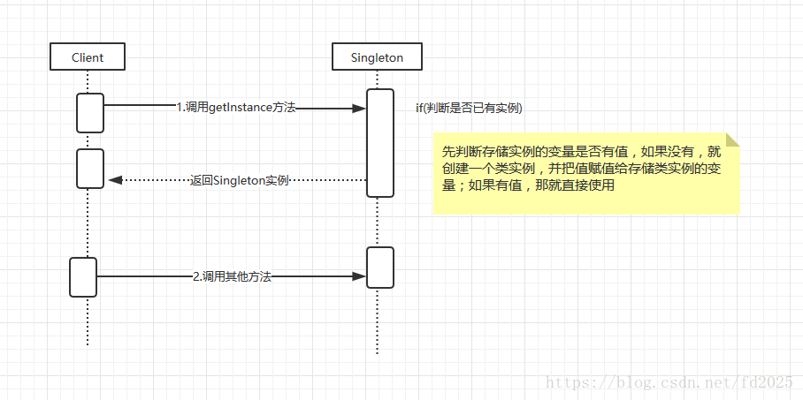
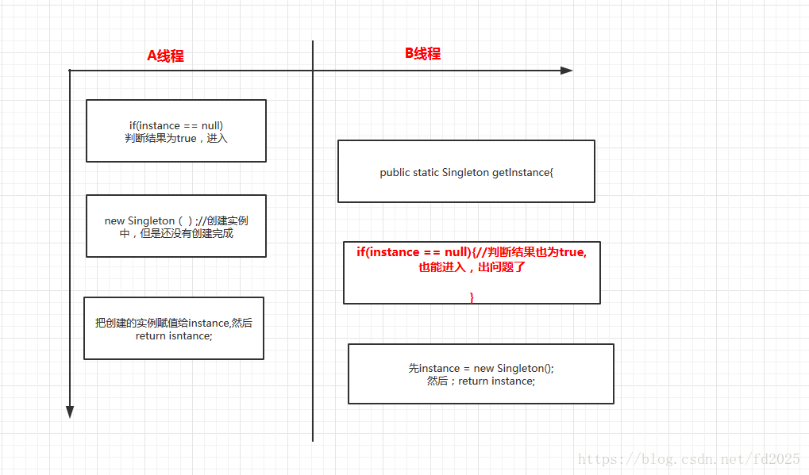

# 单例模式
在有些系统中，为了节省内存资源、保证数据内容的一致性，对某些类要求只能创建一个实例，这就是所谓的单例模式  
## 单例模式的定义与特点
单例（Singleton）模式的定义：指一个类只有一个实例，且该类能自行创建这个实例的一种模式。例如，Windows 中只能打开一个任务管理器，这样可以避免因打开多个任务管理器窗口而造成内存资源的浪费，或出现各个窗口显示内容的不一致等错误  
单例模式在现实生活中的应用也非常广泛，例如公司 CEO、部门经理等都属于单例模型。J2EE 标准中的 ServletContext 和 ServletContextConfig、Spring 框架应用中的 ApplicationContext、数据库中的连接池等也都是单例模式  
**单例模式有 3 个特点：**  
          
    1.单例类只有一个实例对象；
    
    2.该单例对象必须由单例类自行创建；
    
    3.单例类对外提供一个访问该单例的全局访问点
    
 ## 单例模式的优点和缺点
**单例模式的优点：**

    1.单例模式可以保证内存里只有一个实例，减少了内存的开销
    
    2.可以避免对资源的多重占用
    
    3.单例模式设置全局访问点，可以优化和共享资源的访问
    
**单例模式的缺点：**
    
    1.单例模式一般没有接口，扩展困难。如果要扩展，则除了修改原来的代码，没有第二种途径，违背开闭原则
    
    2.在并发测试中，单例模式不利于代码调试。在调试过程中，如果单例中的代码没有执行完，也不能模拟生成一个新的对象
    
    3.单例模式的功能代码通常写在一个类中，如果功能设计不合理，则很容易违背单一职责原则
    
## 单例模式的应用场景
对于 Java 来说，单例模式可以保证在一个 JVM 中只存在单一实例。单例模式的应用场景主要有以下几个方面  

    1.需要频繁创建的一些类，使用单例可以降低系统的内存压力，减少 GC
    
    2.某类只要求生成一个对象的时候，如一个班中的班长、每个人的身份证号等
    
    3.某些类创建实例时占用资源较多，或实例化耗时较长，且经常使用
    
    4.某类需要频繁实例化，而创建的对象又频繁被销毁的时候，如多线程的线程池、网络连接池等
    
    5.频繁访问数据库或文件的对象
    
    6.对于一些控制硬件级别的操作，或者从系统上来讲应当是单一控制逻辑的操作，如果有多个实例，则系统会完全乱套
    
    7.当对象需要被共享的场合。由于单例模式只允许创建一个对象，共享该对象可以节省内存，并加快对象访问速度。如 Web 中的配置对象、数据库的连接池等

## 单例模式的结构与实现
   单例模式是设计模式中最简单的模式之一。通常，普通类的构造函数是公有的，外部类可以通过"new 构造函数()"来生成多个实例。但是，如果将类的构造函数设为私有的，外部类就无法调用该构造函数，也就无法生成多个实例。这时该类自身必须定义一个静态私有实例，并向外提供一个静态的公有函数用于创建或获取该静态私有实例  
### 单例模式的结构
   
### 单例模式的实现
#### 懒汉式单例
该模式的特点是类加载时没有生成单例，只有当第一次调用 getlnstance 方法时才去创建这个单例
```java
public class LazySingleton
{
    //保证 instance 在所有线程中同步
    private static  LazySingleton instance=null;  
   //private 避免类在外部被实例化  
    private LazySingleton(){}    
    public static  LazySingleton getInstance()
    {
        //getInstance 方法前加同步
        if(instance==null)
        {
            instance=new LazySingleton();
        }
        return instance;
    }
}
```
  
单例模式的懒汉式体现了**缓存**的思想，延时加载就是一开始不要加载资源或者数据，一直等，等到马上就要使用这个资源的或者数据了，躲不过去了才去加载  
懒汉式是定性的时间换空间，不加同步的懒汉式是线程不安全的  

```java
public class LazySingleton
{
    //保证 instance 在所有线程中同步
    private volatile static  LazySingleton instance=null;  
   //private 避免类在外部被实例化  
    private LazySingleton(){}    
    public static  LazySingleton getInstance()
    {
        //getInstance 方法前加同步
        if(instance==null) {
           synchronized (LazySingleton.class){
        //getInstance 方法前加同步
        if(instance==null) {
            instance=new LazySingleton(); 
             }
           }
        }
        return instance;
    }
}
```
**注意：** 如果编写的是多线程程序，则不要删除上例代码中的关键字 volatile 和 synchronized，否则将存在线程非安全的问题。如果不删除这两个关键字就能保证线程安全，但是每次访问时都要同步，会影响性能，且消耗更多的资源，这是懒汉式单例的缺点  
#### 饿汉式单例
饿汉式是典型的空间换时间，当类装载的时候就会创建类实例，不管你用不用，先创建出来，然后每次调用的时候，就不需要判断了，节省了运行时间  
该模式的特点是类一旦加载就创建一个单例，保证在调用 getInstance 方法之前单例已经存在了  
```java
public class HungrySingleton
{
    private static final HungrySingleton instance=new HungrySingleton();
    private HungrySingleton(){}
    public static HungrySingleton getInstance()
    {
        return instance;
    }
}
```
饿汉式单例在类创建的同时就已经创建好一个静态的对象供系统使用，以后不再改变，所以是线程安全的，可以直接用于多线程而不会出现问题
## 破坏单例模式的三种方式
### 反射
```java
public class SingletonTest(){
     public static void main(String[] args){
       	      System.out.println("-----------反射----------------------");
       	      //通过反射获取
       	        Constructor<Singleton> cons = Singleton.class.getDeclaredConstructor();
       	        cons.setAccessible(true);
       	        Singleton reflextSingleton = cons.newInstance();
       	        System.out.println(reflextSingleton == originSingleton);//false
     }
}
```
### 序列化
```java
public class Singleton implements Serializable{
      /**
      		 * 1.构造方法私有化，外部不能new
      		 */
      		private Singleton() {}
      		
      		
      		//2.本类内部创建对象实例
      		private static  volatile  Singleton instance;
      		
      		
      		//3.提供一个公有的静态方法，返回实例对象
      		public static  Singleton getInstance() {
      			if(instance == null) {
      				synchronized (Singleton.class) {
      					if(instance == null) {
      						instance = new Singleton();
      					}
      				}
      			}
      			return instance;
      		}

}
public class SingletonTest(){
     public static void main(String[] args){
       	      System.out.println("-----------序列化----------------------");
              	     Singleton originSingleton = Singleton.getInstance();
              	     ByteArrayOutputStream bos = new ByteArrayOutputStream();
              	     ObjectOutputStream oos = new ObjectOutputStream(bos);
              	      oos.writeObject(Singleton.getInstance());
              	      ByteArrayInputStream bis = new ByteArrayInputStream(bos.toByteArray());
              	      ObjectInputStream ois = new ObjectInputStream(bis);
              	      Singleton serializeSingleton = (Singleton) ois.readObject();
              	      System.out.println(originSingleton == serializeSingleton);//false
     }
}

```
### 克隆
```java
public class Singleton implements Cloneable{
      /**
      		 * 1.构造方法私有化，外部不能new
      		 */
      		private Singleton() {}
      		
      		
      		//2.本类内部创建对象实例
      		private static  volatile  Singleton instance;
      		
      		
      		//3.提供一个公有的静态方法，返回实例对象
      		public static  Singleton getInstance() {
      			if(instance == null) {
      				synchronized (Singleton.class) {
      					if(instance == null) {
      						instance = new Singleton();
      					}
      				}
      			}
      			return instance;
      		}
         @Override
		 protected Object clone() throws CloneNotSupportedException {
		     return super.clone();
		  }
}
public class SingletonTest(){
     public static void main(String[] args){
       	      System.out.println("-----------序列化----------------------");
              	     Singleton originSingleton = Singleton.getInstance();
              	     ByteArrayOutputStream bos = new ByteArrayOutputStream();
              	     ObjectOutputStream oos = new ObjectOutputStream(bos);
              	      oos.writeObject(Singleton.getInstance());
              	      ByteArrayInputStream bis = new ByteArrayInputStream(bos.toByteArray());
              	      ObjectInputStream ois = new ObjectInputStream(bis);
              	      Singleton serializeSingleton = (Singleton) ois.readObject();
              	      System.out.println(originSingleton == serializeSingleton);//false
     }
}
```
### 解决方案
       1.防止反射--定义一个全局变量，当第二次创建的时候抛出异常

       2、防止克隆破坏--重写clone(),直接返回单例对象

       3、防止序列化破坏--添加readResolve(),返回Object对象
```java
/**
 * 序列化对单例的破坏,解决方案
 * @author Administrator
 *
 */
public class SingletonTest10 {
	
	public static void main(String[] args) throws Exception{
		
		System.out.println("-----------序列化----------------------");
	     Singleton originSingleton = Singleton.getInstance();
	     ByteArrayOutputStream bos = new ByteArrayOutputStream();
	     ObjectOutputStream oos = new ObjectOutputStream(bos);
	      oos.writeObject(Singleton.getInstance());
	      ByteArrayInputStream bis = new ByteArrayInputStream(bos.toByteArray());
	      ObjectInputStream ois = new ObjectInputStream(bis);
	      Singleton serializeSingleton = (Singleton) ois.readObject();
	      System.out.println(originSingleton == serializeSingleton);//false
	      
	      System.out.println("-----------反射----------------------");
	      //通过反射获取
	        Constructor<Singleton> cons = Singleton.class.getDeclaredConstructor();
	        cons.setAccessible(true);
	        Singleton reflextSingleton = cons.newInstance();
	        System.out.println(reflextSingleton == originSingleton);//false
	        
	        System.out.println("---------------------------克隆----------------------");
	        
	        Singleton cloneSingleton = (Singleton) originSingleton.clone();
	        System.out.println(cloneSingleton == originSingleton);//false
	    
	}
	
	private static class Singleton  implements Serializable,Cloneable{
		
		private static volatile boolean isCreate = false;//默认是第一次创建
		/**
		 * 1.构造方法私有化，外部不能new
		 */
		private Singleton() {
			if(isCreate) {
				throw new RuntimeException("已然被实例化一次，不能在实例化");
			}
			isCreate = true;
		}
		
		
		//2.本类内部创建对象实例
		private static  volatile  Singleton instance;
		
		
		//3.提供一个公有的静态方法，返回实例对象
		public static  Singleton getInstance() {
			if(instance == null) {
				synchronized (Singleton.class) {
					if(instance == null) {
						instance = new Singleton();
					}
				}
			}
			return instance;
		}
		
		@Override
		 protected Object clone() throws CloneNotSupportedException {
		     return instance;
		 }
		
		/**
		 * 防止序列化破环
		 * @return
		 */
		private Object readResolve() {
	        return instance;
	    }
		 
	}
	
}
```
