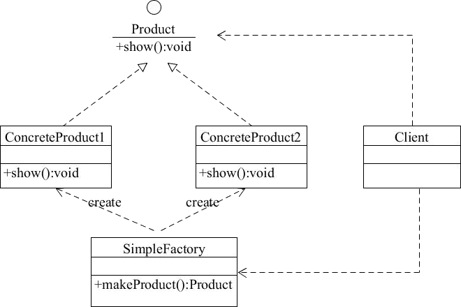

# 简单工厂模式
**工厂模式的定义：** 定义一个创建产品对象的工厂接口，将产品对象的实际创建工作推迟到具体子工厂类当中。这满足创建型模式中所要求的"创建与使用相分离"的特点  
按实际业务场景划分，工厂模式有 3 种不同的实现方式，分别是**简单工厂模式**、**工厂方法模式**和**抽象工厂模式**  
我们把被创建的对象称为"产品"，把创建产品的对象称为"工厂"。如果要创建的产品不多，只要一个工厂类就可以完成，这种模式叫"简单工厂模式"  
在简单工厂模式中创建实例的方法通常为静态（static）方法，因此简单工厂模式（Simple Factory Pattern）又叫作**静态工厂方法模式（Static Factory Method Pattern）**  
简单来说，简单工厂模式有一个具体的工厂类，可以生成多个不同的产品，属于创建型设计模式。**简单工厂模式不在 GoF 23 种设计模式之列**  
## 优点以及缺点
### 优点
     1.工厂类包含必要的逻辑判断，可以决定在什么时候创建哪一个产品的实例。客户端可以免除直接创建产品对象的职责，很方便的创建出相应的产品。工厂和产品的职责区分明确  
     
     2.客户端无需知道所创建具体产品的类名，只需知道参数即可
     
     3.也可以引入配置文件，在不修改客户端代码的情况下更换和添加新的具体产品类
     
### 缺点
     1.简单工厂模式的工厂类单一，负责所有产品的创建，职责过重，一旦异常，整个系统将受影响。且工厂类代码会非常臃肿，违背高聚合原则
     
     2.使用简单工厂模式会增加系统中类的个数（引入新的工厂类），增加系统的复杂度和理解难度
     
     3.系统扩展困难，一旦增加新产品不得不修改工厂逻辑，在产品类型较多时，可能造成逻辑过于复杂
     
     4.简单工厂模式使用了 static 工厂方法，造成工厂角色无法形成基于继承的等级结构
     
## 模式的结构与实现
**简单工厂模式的主要角色如下：**  
     **简单工厂（SimpleFactory）:** 是简单工厂模式的核心，负责实现创建所有实例的内部逻辑。工厂类的创建产品类的方法可以被外界直接调用，创建所需的产品对象  
     **抽象产品（Product）：** 是简单工厂创建的所有对象的父类，负责描述所有实例共有的公共接口  
     **具体产品（ConcreteProduct）：** 是简单工厂模式的创建目标  
   
**根据上图写出该模式的代码如下：**
  ```java
public class Client {
    public static void main(String[] args) {
    }

    //抽象产品
    public interface Product {
        void show();
    }

    //具体产品：ProductA
    static class ConcreteProduct1 implements Product {
        public void show() {
            System.out.println("具体产品1显示...");
        }
    }

    //具体产品：ProductB
    static class ConcreteProduct2 implements Product {
        public void show() {
            System.out.println("具体产品2显示...");
        }
    }

    final class Const {
        static final int PRODUCT_A = 0;
        static final int PRODUCT_B = 1;
        static final int PRODUCT_C = 2;
    }

    static class SimpleFactory {
        public static Product makeProduct(int kind) {
            switch (kind) {
                case Const.PRODUCT_A:
                    return new ConcreteProduct1();
                case Const.PRODUCT_B:
                    return new ConcreteProduct2();
               default:
                    break;
            }
            return null;
        }
    }
}
```
