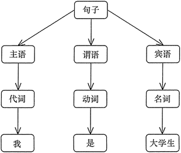

# 解释器模式
## 模式的定义与特点
**解释器（Interpreter）模式的定义：** 给分析对象定义一个语言，并定义该语言的文法表示，再设计一个解析器来解释语言中的句子。也就是说，用编译语言的方式来分析应用中的实例。这种模式实现了文法表达式处理的接口，该接口解释一个特定的上下文  
这里提到的文法和句子的概念同编译原理中的描述相同，“文法”指语言的语法规则，而“句子”是语言集中的元素。例如，汉语中的句子有很多，“我是中国人”是其中的一个句子，可以用一棵语法树来直观地描述语言中的句子  
### 优点
    
    1.扩展性好。由于在解释器模式中使用类来表示语言的文法规则，因此可以通过继承等机制来改变或扩展文法。
    
    2.容易实现。在语法树中的每个表达式节点类都是相似的，所以实现其文法较为容易
### 缺点
    
    1.执行效率较低。解释器模式中通常使用大量的循环和递归调用，当要解释的句子较复杂时，其运行速度很慢，且代码的调试过程也比较麻烦。
    
    2.会引起类膨胀。解释器模式中的每条规则至少需要定义一个类，当包含的文法规则很多时，类的个数将急剧增加，导致系统难以管理与维护。
    
    3.可应用的场景比较少。在软件开发中，需要定义语言文法的应用实例非常少，所以这种模式很少被使用到
## 模式的结构与实现
解释器模式常用于对简单语言的编译或分析实例中，为了掌握好它的结构与实现，必须先了解编译原理中的 **“文法、句子、语法树”** 等相关概念  
### 文法
文法是用于描述语言的语法结构的形式规则。没有规矩不成方圆，例如，有些人认为完美爱情的准则是“相互吸引、感情专一、任何一方都没有恋爱经历”，虽然最后一条准则较苛刻，但任何事情都要有规则，语言也一样，不管它是机器语言还是自然语言，都有它自己的文法规则  
```
〈句子〉::=〈主语〉〈谓语〉〈宾语〉
〈主语〉::=〈代词〉|〈名词〉
〈谓语〉::=〈动词〉
〈宾语〉::=〈代词〉|〈名词〉
〈代词〉你|我|他
〈名词〉7大学生I筱霞I英语
〈动词〉::=是|学习
```
**注：这里的符号“::=”表示“定义为”的意思，用“〈”和“〉”括住的是非终结符，没有括住的是终结符**
### 句子
句子是语言的基本单位，是语言集中的一个元素，它由终结符构成，能由“文法”推导出。例如，上述文法可以推出“我是大学生”，所以它是句子
### 语法树
语法树是句子结构的一种树型表示，它代表了句子的推导结果，它有利于理解句子语法结构的层次  

### 模式的结构
**解释器模式包含以下主要角色**  
     
     1.抽象表达式（Abstract Expression）角色：定义解释器的接口，约定解释器的解释操作，主要包含解释方法 interpret()。
     
     2.终结符表达式（Terminal    Expression）角色：是抽象表达式的子类，用来实现文法中与终结符相关的操作，文法中的每一个终结符都有一个具体终结表达式与之相对应。
     
     3.非终结符表达式（Nonterminal Expression）角色：也是抽象表达式的子类，用来实现文法中与非终结符相关的操作，文法中的每条规则都对应于一个非终结符表达式。
     
     4.环境（Context）角色：通常包含各个解释器需要的数据或是公共的功能，一般用来传递被所有解释器共享的数据，后面的解释器可以从这里获取这些值。
     
     5.客户端（Client）：主要任务是将需要分析的句子或表达式转换成使用解释器对象描述的抽象语法树，然后调用解释器的解释方法，当然也可以通过环境角色间接访问解释器的解释方法

### 模式的实现
```java
//抽象表达式类
interface AbstractExpression
{
    public Object interpret(String info);    //解释方法
}
//终结符表达式类
class TerminalExpression implements AbstractExpression
{
    public Object interpret(String info)
    {
        //对终结符表达式的处理
    }
}
//非终结符表达式类
class NonterminalExpression implements AbstractExpression
{
    private AbstractExpression exp1;
    private AbstractExpression exp2;
    public Object interpret(String info)
    {
        //非对终结符表达式的处理
    }
}
//环境类
class Context
{
    private AbstractExpression exp;
    public Context()
    {
        //数据初始化
    }
    public void operation(String info)
    {
        //调用相关表达式类的解释方法
    }
}
```
